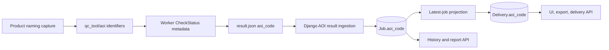

# AOI metadata

QC Tool stores one optional canonical `aoi_code` on every job and delivery.
The value is optional because some products have no AOI and a failed,
incomplete, or ambiguous check must remain `null` rather than be guessed.

## Why a canonical boundary exists

Product naming contracts use several names for the same concept. They are
accepted only where a QC check reads external metadata:

| External name | Canonical application field |
| --- | --- |
| `aoi_code` | `aoi_code` |
| `delivery_unit_id` | `aoi_code` |
| `fua_code`, `fua` | `aoi_code` |
| `du_id`, `du` | `aoi_code` |
| `code_city`, `codecity` | `aoi_code` |

Alias spelling is case- and separator-insensitive. Public worker results,
Django models, HTML pages, exports, and API responses expose only `aoi_code`.
The identifier is trimmed and case-folded. Established Urban Atlas and N2K
suffixes are normalized to their shared FUA or delivery-unit identifier.
Purely numeric identifiers are stored without leading zeroes, so values such
as `007` and `7` cannot become separate indexed records for the same AOI.

## Data flow



The implementation is intentionally split into small modules:

```text
qc_tool/aoi/
├── constants.py       stable public key and input aliases
├── identifiers.py     pure normalization and conflict detection
└── metadata.py        job-step metadata merge contract

qc_tool/worker/
├── aoi/
│   ├── metadata.py    worker result adapter
│   └── naming.py      generic raster/vector naming boundary
└── status.py          lightweight QC check result object

frontend/dashboard/services/aoi/
├── artifacts.py       bounded, no-follow result loading
├── contracts.py       typed persistence actions
├── errors.py          stable service exceptions
├── results.py         untrusted result ingestion
├── projections.py     deterministic delivery projection
├── lifecycle.py       transactional create/status hooks
└── backfill.py        bounded historical artifact backfill
```

## Persistence rules

- Uploading or registering a delivery starts with `aoi_code = null`.
- A new job also starts with `aoi_code = null`.
- Waiting and running status updates never read result metadata.
- A terminal status reads the job result and stores a valid canonical value.
- A missing or malformed field preserves the current value.
- An explicit JSON `null` clears the value.
- `Delivery.aoi_code` mirrors the deterministically latest job, ordered by
  creation time and then UUID.
- Creating a newer job therefore resets the delivery projection until the new
  result reports an AOI.
- Deleting the latest job reprojects from the remaining history.
- Conflicting observations produce `null`; the system never chooses one.

Delivery projection changes lock the delivery row first. This is the shared
lock order for creation, status updates, and job deletion, avoiding stale
metadata and reducing deadlock risk during overlapping requests.
Jobs are read-only in Django Admin because direct edits or deletes would bypass
that lifecycle. Use the permission-checked job-history workflow for deletion.

## Security and trust boundary

AOI is currently **reporting metadata**, not an authorization fact. A name
captured from uploaded content is influenced by the uploader. Region access
continues to use the existing grant/legacy-region policy until every supported
product has an authoritative spatial AOI validation contract.

Do not change region authorization to use `Delivery.aoi_code` merely because
the field is populated. That future change requires:

1. authoritative validation for every AOI-bearing product;
2. explicit semantics for collapsed FUA and delivery-unit suffixes;
3. normalized grant and personal-token snapshot migration;
4. historical-job object-access tests; and
5. a deliberate fail-closed rollout for deliveries whose AOI is unavailable.

This separation lets new aliases be added safely without coupling the shared
identifier package to product definitions or raster/vector implementations.

## Historical jobs

Schema migrations do not read files from shared storage. After deploying the
new columns, an operator may inspect and backfill existing terminal results:

```bash
python3 -m qc_tool.frontend.manage backfill_aoi_metadata --dry-run --limit 100
python3 -m qc_tool.frontend.manage backfill_aoi_metadata --batch-size 100
```

The command is ordered, bounded, idempotent, and ignores unreadable or
ambiguous results. Result documents are opened without following symbolic
links and are capped at 16 MiB before JSON decoding. Run it while the shared
job-result volume is mounted.

The schema migrations also recognize columns created by the former dev AOI
work. They adopt those columns, canonicalize existing Job values in bounded
batches, rebuild every Delivery projection from its deterministic latest Job,
then reconcile the database to the stable `dash_job_aoi_idx` and
`dash_delivery_aoi_idx` index names used by the current models. This also
repairs a partially applied dev schema that had only the Job AOI migration.
