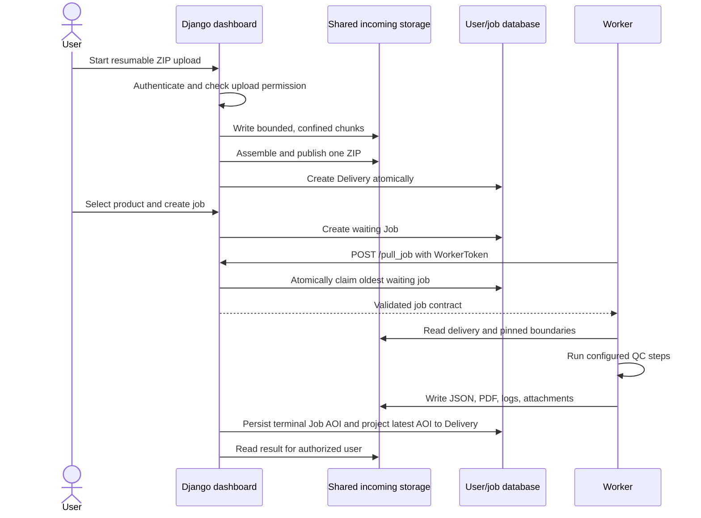

# Delivery and job flow

## Browser upload

The browser stages ZIP files for review and checks only the signed-in user's
existing filenames. New files offer **Upload**; eligible duplicates offer
**Replace and upload**. The batch action says **Upload all** for new files or
**Replace and upload all** when it includes replacements and displays the
new/replacement counts. Protected submissions,
waiting/running QC, S3 records and ambiguous duplicates are explained and skipped.

Overwrite approval is pinned to the inspected delivery ID and checked again
before sending and at finalization. The server stages the complete replacement,
retains the old archive, retires the old delivery identity, then publishes and
activates a fresh delivery under a filename lock. Old QC history is retained;
the replacement needs new QC. Durable recovery records keep old QC from being
associated with new bytes even if a process stops between database and file
operations. The [upload maintenance guide](../development/upload-pages.md#recover-an-interrupted-overwrite)
describes browser retry and operator recovery. New selections use fresh upload
identifiers; retries keep their identifier and overwrite target.



Resumable metadata is validated before filesystem use. Upload identifiers map
to opaque storage keys, path components are confined, chunks have explicit
limits, and assembly and registration share an upload lock. A chunk probe cannot
report a completed upload until a live Delivery record exists. Fully staged
uploads require a final POST to finish registration.

Database creation occurs after the complete ZIP is published. An ownership link
in private staging retains the published inode until registration succeeds, so
an interrupted database write can be retried without overwriting an unrelated
file. An atomic registration receipt binds the upload to its Delivery ID and
file identity. Concurrent final chunks and retries return the same Delivery;
chunks are discarded only after that receipt is durable. If the delivery was
deleted, its receipt no longer proves completion and reuploading starts with
fresh chunks, even when the browser reuses its upload identifier.

Canonical AOI metadata is stored only after a terminal result is available;
see [AOI metadata](aoi-metadata.md) for aliases, projection, and trust rules.

## S3 delivery

S3 is disabled unless both frontend and worker receive an exact HTTPS origin
allowlist.

1. An API client registers an S3 endpoint, bucket, and prefix.
2. The frontend validates the JSON contract, endpoint, bucket, object count,
   timeouts, and caller permission.
3. S3 credentials and location are attached to the Delivery record.
4. When the worker runs the job, its S3 adapter revalidates the origin and
   object listing.
5. Objects are streamed into no-follow private files with total byte limits.
6. A single ZIP is extracted through the bounded archive service; multiple
   objects are hashed deterministically as a set.

S3 credentials are never accepted in endpoint URLs. The deployment must also
prevent request-header logging and protect database backups.

## Boundary package lifecycle

Boundary uploads do not overwrite live `raster/` and `vector/` directories in
place. A validated package becomes an immutable generation:

```text
BOUNDARY_DIR/
├── .boundary-current -> .boundary-generations/<generation-id>
├── .boundary-generations/
│   └── <generation-id>/
│       ├── raster/
│       └── vector/
├── raster -> .boundary-current/raster
└── vector -> .boundary-current/vector
```

Publishing replaces one pointer. Each job resolves that pointer once and keeps
the resulting generation path for the complete job, so concurrent uploads do
not mix files from different generations.

Old generations are intentionally retained while readers may still reference
them. Retention and pruning must be an explicit operational policy.

## Storage and persistence

| Data | Default local location | Consumers |
| --- | --- | --- |
| Django users, deliveries, jobs | PostgreSQL `userdb` | frontend |
| Uploaded deliveries | `INCOMING_DIR` shared volume | frontend, worker |
| Boundary generations | `BOUNDARY_DIR` shared volume | frontend, worker |
| Results and worker token | `WORK_DIR` shared volume | frontend, worker |
| Submission copies | `SUBMISSION_DIR` shared volume | frontend |
| Worker scratch and QC database | worker container | worker job only |

Back up the user database and all required shared volumes as one operational
system. A database-only backup may point to delivery or result files that no
longer exist.
