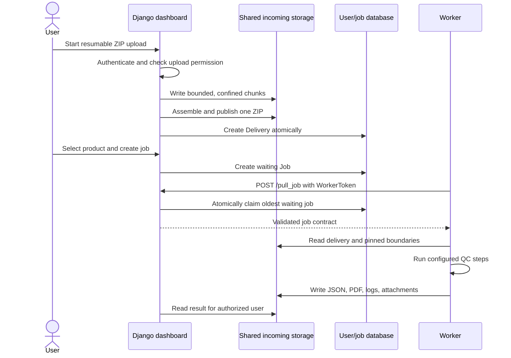

# Delivery and job flow

## Browser upload



Resumable metadata is validated before filesystem use. Upload identifiers map
to opaque storage keys, path components are confined, chunks have explicit
limits, and assembly rechecks the layout under a lock. Database creation occurs
after a complete file is published; failed creation removes the orphaned file.

## S3 delivery

S3 is disabled unless both frontend and worker receive an exact HTTPS origin
allowlist.

1. An API client registers an S3 endpoint, bucket, and prefix.
2. The frontend validates the JSON contract, endpoint, bucket, object count,
   timeouts, and caller permission.
3. S3 credentials and location are attached to the Delivery record.
4. When the worker runs the job, its S3 adapter revalidates the origin and
   object listing.
5. Objects are streamed into no-follow private files with total byte limits.
6. A single ZIP is extracted through the bounded archive service; multiple
   objects are hashed deterministically as a set.

S3 credentials are never accepted in endpoint URLs. The deployment must also
prevent request-header logging and protect database backups.

## Boundary package lifecycle

Boundary uploads do not overwrite live `raster/` and `vector/` directories in
place. A validated package becomes an immutable generation:

```text
BOUNDARY_DIR/
├── .boundary-current -> .boundary-generations/<generation-id>
├── .boundary-generations/
│   └── <generation-id>/
│       ├── raster/
│       └── vector/
├── raster -> .boundary-current/raster
└── vector -> .boundary-current/vector
```

Publishing replaces one pointer. Each job resolves that pointer once and keeps
the resulting generation path for the complete job, so concurrent uploads do
not mix files from different generations.

Old generations are intentionally retained while readers may still reference
them. Retention and pruning must be an explicit operational policy.

## Storage and persistence

| Data | Default local location | Consumers |
| --- | --- | --- |
| Django users, deliveries, jobs | PostgreSQL `userdb` | frontend |
| Uploaded deliveries | `INCOMING_DIR` shared volume | frontend, worker |
| Boundary generations | `BOUNDARY_DIR` shared volume | frontend, worker |
| Results and worker token | `WORK_DIR` shared volume | frontend, worker |
| Submission copies | `SUBMISSION_DIR` shared volume | frontend |
| Worker scratch and QC database | worker container | worker job only |

Back up the user database and all required shared volumes as one operational
system. A database-only backup may point to delivery or result files that no
longer exist.
