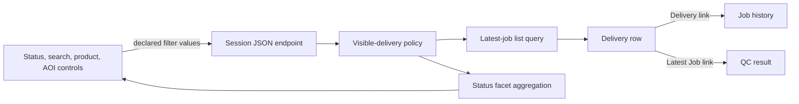

# Deliveries workspace

The Deliveries page presents two related domain objects without conflating
them:

- a **Delivery** is one uploaded or S3-registered package;
- a **Job** is one QC run for that Delivery.

The delivery name opens that Delivery's complete job history. The separate
**View latest QC job** link opens the newest job result. Histories are joined by
`Delivery.id`, never by filename, because filenames are not unique.

## Status model

Every visible Delivery belongs to exactly one quick-filter state. The server
classifies rows in this order:

1. `submitted` when the Delivery has a submission timestamp;
2. `not_validated` when no latest Job exists;
3. `running` for a queued or running latest Job;
4. `passed` for a successful latest Job;
5. `failed` for every other non-null latest Job state.

Success is deliberately allow-listed. A future or legacy worker state therefore
appears under **Failed** rather than silently disappearing. Filter counts apply
the user's access scope plus the current search, product, and AOI filters before
the selected status filter.

## Request and presentation flow



The UI does not infer status groups from the current browser page. Filtering
and pagination stay server-side, so counts and rows remain correct for datasets
larger than one page.

## Module layout

```text
dashboard/services/deliveries/
├── listing/
│   ├── statuses.py       declared state vocabulary and SQL clauses
│   └── facets.py         access-scoped counts
└── summary.py            dashboard overview summary

dashboard/static/dashboard/js/deliveries/
├── formatters.js         safe row rendering and action eligibility
├── table.js              filters, pagination, sorting, accessibility
├── dialogs.js            delete and submission confirmations
├── actions.js            row and current-page selection coordination
└── polling.js            bounded running-job status refresh

dashboard/static/dashboard/css/pages/deliveries/
├── layout.css
├── filters.css
├── table.css
└── responsive.css
```

The template keeps stable IDs used by the table and action modules. Untrusted
filenames, product descriptions, AOI codes, usernames, and server messages are
inserted through text APIs rather than HTML interpolation.

## Action rules

Row actions target exactly one Delivery. Bulk actions target selected rows on
the current page. A mixed selection is never silently reduced: an action is
enabled only when every selected row is eligible.

The browser's `can_*` fields are presentation hints. Django permissions,
ownership, current job state, submission configuration, and CSRF protection
are rechecked by the mutation endpoint.

## Regression coverage

The focused contracts live in:

- `dashboard/tests/test_delivery_status_filters.py`;
- `dashboard/tests/test_delivery_list_presentation.py`;
- `dashboard/tests/test_job_history_association.py`;
- `accounts/tests/test_delivery_workspace_presentation.py`.

They cover access-scoped and mutually exclusive counts, submitted precedence,
strict status input, duplicate filenames, safe server-reversed links,
permission-driven controls, and accessible filter/table structure.
