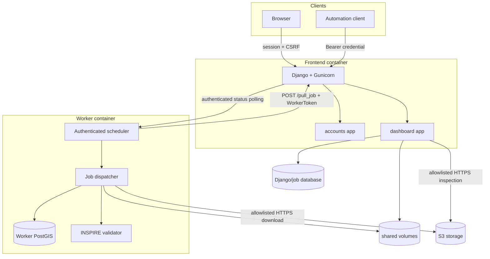

# Architecture

QC Tool is a two-application system connected through a database, shared
storage, and an authenticated job-polling protocol:

- the **Django frontend** owns users, permissions, deliveries, jobs, UI, and
  public/private HTTP contracts;
- the **worker** claims queued jobs, materializes their input, runs configured
  QC steps, and writes reports and artifacts;
- a **user database** stores Django and dashboard state;
- **shared storage** carries uploads, boundary generations, job artifacts, and
  the internal worker token.

## Runtime components



## Dependency direction

The intended dependency direction is:

```text
accounts facts and capabilities
        ↓
dashboard object and route policies
        ↓
dashboard views, templates, and services

shared security packages
        ↓
frontend and worker adapters
        ↓
QC step implementations
```

`accounts` must not import delivery or job models. It provides reusable account
facts. `dashboard/access/` combines those facts with domain ownership and scope.
HTTP views should call services and access policies instead of reimplementing
either.

## Key design decisions

| Decision | Reason |
| --- | --- |
| Public/private visibility is explicit | A new named dashboard route cannot silently become public |
| Authentication is separate from visibility | Browser sessions, API credentials, and worker tokens have different contracts |
| Django permissions represent capabilities | Role and direct user permissions are naturally additive |
| Product and region grants represent scope | A capability alone does not silently grant access to every record |
| Object access lives in `dashboard/access/` | Accounts remains independent of Delivery and Job models |
| Input boundaries use dedicated services | Views remain small and validation is reusable and testable |
| Workers poll the frontend | Frontend owns queue state; workers can scale horizontally |
| Boundary packages use immutable generations | A job reads one pinned multi-file snapshot |

Continue with:

- [Repository layout](repository-layout.md)
- [Delivery and job flow](data-and-job-flow.md)
- [Deliveries workspace](deliveries-workspace.md)
- [AOI metadata](aoi-metadata.md)
- [Authentication and authorization](authentication-and-authorization.md)
- [Development guide](../development/index.md)
