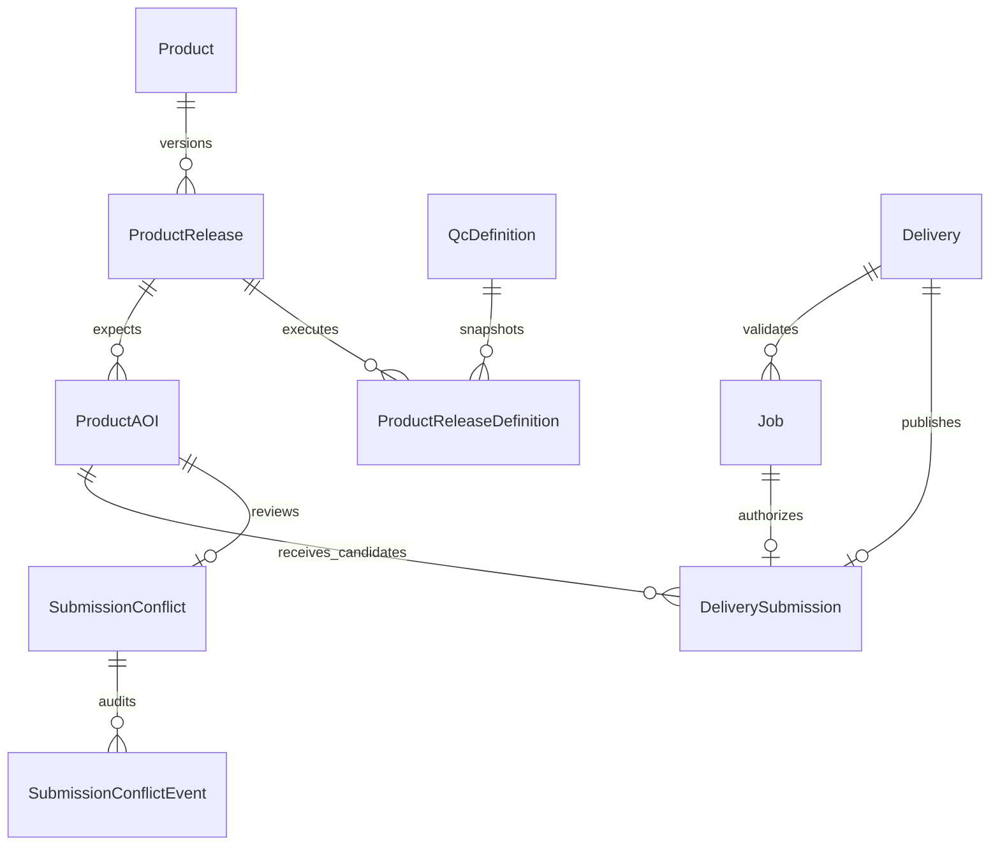

# Product catalog and submissions

The submission lifecycle answers two different questions without conflating
them:

1. What AOIs are expected for this immutable product release?
2. Which validated ZIP candidates have users published for each expected AOI?

`ProductAOI.aoi_code` answers the first question. It is authoritative and is
never created from a delivery filename or worker observation.
`Job.aoi_code_submitted` answers what QC verified inside one ZIP.
`DeliverySubmission` links an exact successful Job to an exact ProductAOI and
stores immutable snapshots of both values.
Job and submission provenance also snapshots the requesting/submitting user,
API-token identifier, and token name. Token identifiers are intentionally not
foreign keys: deleting a credential must not rewrite historical audit facts.

## Relational ownership



One-to-one constraints ensure a Delivery and its authorizing Job can each
produce at most one durable submission. There is intentionally no uniqueness
constraint from `DeliverySubmission` to `ProductAOI`: multiple users must be
able to publish competing candidates without overwriting one another.

## Catalog ownership

Definitions in `product_definitions/` describe executable QC checks. Their
filenames and descriptions are not reliable release-grouping metadata, and an
`aoi_codes` check parameter is not automatically an authoritative completion
plan. Release grouping and coverage therefore come from an explicit,
version-controlled manifest:

```json
{
  "schema_version": 1,
  "products": [
    {
      "ident": "clc2024",
      "name": "CLC 2024",
      "description": "Corine Land Cover 2024",
      "releases": [
        {
          "release_key": "clc-2024-production",
          "revision": 1,
          "description": "CLC 2024 production scope",
          "is_current": true,
          "definition_idents": ["clc2024"],
          "primary_definition": "clc2024",
          "coverage": {
            "state": "authoritative",
            "source_definition": "clc2024"
          }
        }
      ]
    }
  ]
}
```

Coverage may instead contain an explicit `aoi_codes` list. Wildcard lists
cannot define a denominator. Products without an approved finite plan use
`state: "unknown"`; their expected, submitted, and remaining counts are null,
not zero or 100 percent.

The synchronization service parses and validates every referenced definition
before writing. It normalizes and deduplicates AOIs, takes a PostgreSQL
transaction advisory lock, creates immutable definition/release revisions,
and moves a current pointer only after the complete revision exists. Changed
catalog content requires a higher release revision and links to the revision it
supersedes.

## Job and submission lifecycle

```mermaid
sequenceDiagram
    actor User
    participant UI as Browser or API
    participant DB as PostgreSQL
    participant Worker
    participant Store as Submission storage
    actor Manager as Product manager

    User->>UI: Upload one-AOI ZIP
    UI->>DB: Create Delivery
    User->>UI: Request QC for explicit definition
    UI->>DB: Create Job + actor/definition/release snapshot
    Worker->>DB: Claim and complete Job
    Worker-->>UI: result.json with aoi_code
    UI->>DB: Store aoi_code_submitted + result metadata
    User->>UI: Submit delivery
    UI->>DB: Lock Delivery/latest Job and reserve DeliverySubmission
    UI->>Store: Copy to private staging directory
    UI->>Store: Atomic rename to submission UUID path
    UI->>DB: Finalize published record and legacy timestamp
    DB-->>Manager: Open conflict for another user's candidate
    Manager->>DB: Select one published candidate
    DB->>DB: Append resolution event; retain every candidate
```

Browser and API endpoints are thin adapters over the same service. Reservation
requires the deterministically latest Job to be successful, to contain one
canonical submitted AOI, and to reference an authoritative release and exact
QC definition revision. It also requires a valid SHA-256 snapshot binding the
published input to the exact ZIP or S3 object set inspected by QC. A successful
older Job never overrides a newer failed or running Job. Once a Job reaches a
terminal state, later polling cannot rewrite its terminal status, AOI, result
metadata, or input digest.

Publication uses a deterministic directory keyed by the server-generated
submission UUID. Files are copied without following symbolic links into a
same-filesystem staging directory. A manifest records the delivery, Job,
release, both AOI values, input checksum, and hashes of published files. One
atomic rename exposes the complete directory. A retry accepts an existing
directory only if its bounded manifest identifies the same submission and
the no-follow file inventory still matches every recorded path, size, and
SHA-256 digest.

The database and filesystem form a recoverable saga:

- failure before rename leaves a `failed` submission that can be retried;
- failure after rename is recovered by the deterministic manifest;
- no failure path clears `Delivery.date_submitted`;
- finalization writes the exact same timestamp to the durable submission and
  legacy Delivery field;
- PostgreSQL rejects a `published` row without publication and input digests;
- one Delivery and authorizing Job have at most one DeliverySubmission;
- many deliveries may point to one ProductAOI.

## Conflicts and coverage

Two different users may publish candidates for the same ProductAOI. Both
candidates remain published. The second publication opens one durable
`SubmissionConflict`; candidates are never overwritten or deleted. A scoped
product manager selects a winner from the Django Admin submission list.
Resolution updates the current selection and appends a
`SubmissionConflictEvent`. A later candidate reopens the conflict while the
earlier decision remains in the audit log.

Coverage counts distinct expected ProductAOI rows, never submission rows:

- `expected`: AOIs in an authoritative release;
- `submitted`: AOIs with a published candidate and no open conflict;
- `conflicts`: AOIs with unresolved competing candidates;
- `remaining`: expected minus submitted.

Duplicates therefore cannot inflate completion.

## Deployment order

```bash
python3 -m qc_tool.frontend.manage migrate
python3 -m qc_tool.frontend.manage sync_product_catalog path/to/catalog.json --dry-run
python3 -m qc_tool.frontend.manage sync_product_catalog path/to/catalog.json
python3 -m qc_tool.frontend.manage backfill_aoi_metadata --dry-run
python3 -m qc_tool.frontend.manage backfill_aoi_metadata --batch-size 100
```

Catalog synchronization is an explicit post-deploy operation. Migrations never
read product definitions or shared result files. Historical legacy submissions
remain fail-closed until they are reconciled; the new service does not guess an
authorizing Job or expected release.
