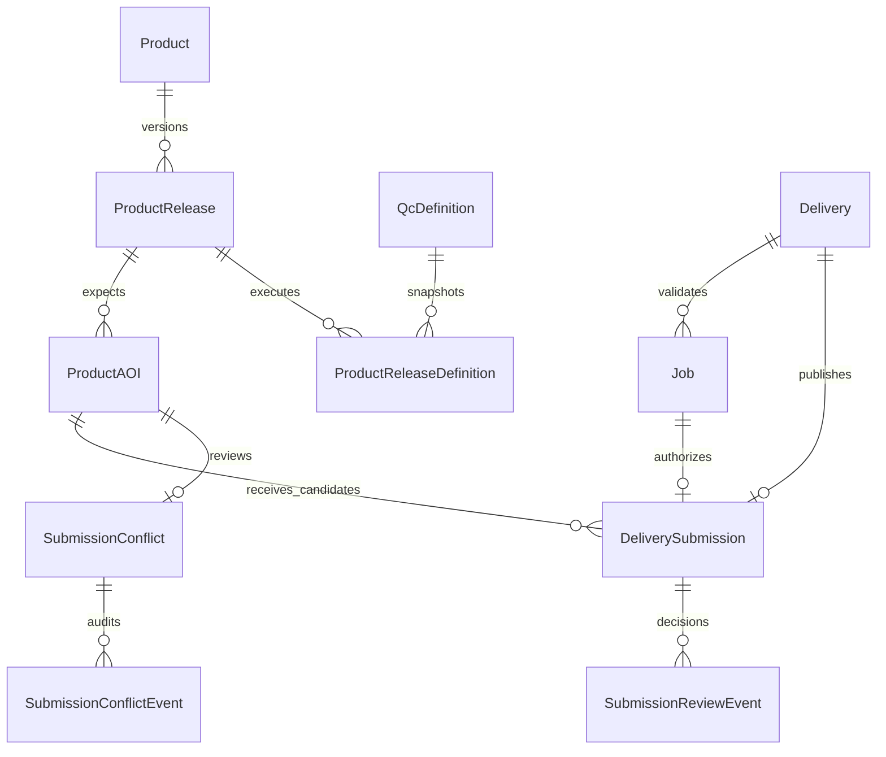

# Product catalog and submissions

The submission lifecycle answers three different questions without conflating
them:

1. What AOIs are expected for this immutable product release?
2. Which validated ZIP candidates have users published for each expected AOI?
3. Which candidates have assigned product managers or administrators approved?

`ProductAOI.aoi_code` records the declared scope; it answers the first question
when its release is authoritative. It is never created from a delivery filename
or worker observation.
`Job.aoi_code_submitted` answers what QC verified inside one ZIP.
`DeliverySubmission` links an exact successful Job to an exact ProductAOI and
stores immutable snapshots of both values.
Job and submission provenance also snapshots the requesting/submitting user,
API-token identifier, and token name. Token identifiers are intentionally not
foreign keys: deleting a credential must not rewrite historical audit facts.

## Relational ownership

The central [application schema](../../src/qc_tool/database/SCHEMA.md) maps these
models to the `catalog_*`, `execution_*` and `publication_*` tables in one database.



One-to-one constraints ensure a Delivery and its authorizing Job can each
produce at most one durable submission. There is intentionally no uniqueness
constraint from `DeliverySubmission` to `ProductAOI`: multiple users must be
able to publish competing candidates without overwriting one another.

## Catalog ownership

Definitions describe executable QC checks. Reviewed recipes enter through
directory import from `product_definitions/` or the administrator upload
page at `/products/upload/`. `QcDefinition.document` stores the full imported
document as PostgreSQL JSONB; its digest identifies the original file bytes.
Recipes remain flexible while products, release links and expected AOIs have
relational identities and constraints.

`sync_product_definitions` imports a directory inventory into immutable
definition revisions. It creates one business product per canonical filename
stem and an initial release stream `definition:<ident>`. A consistent finite
naming AOI list becomes a draft scope; missing, wildcard or empty lists remain
unknown. These records make definition attributes and declared AOI counts
queryable without implying that a delivery plan has been approved.

Browser uploads use the same product/release representation and scope rules.
The page stages selected JSON files in a review queue. **Add** sends one file;
**Add all** sends the ready files sequentially, with a separate result for each.
Identical specifications are explicitly reported as already added. Failed files
remain retryable without removing earlier successful additions.
Only administrators can upload versions or remove specifications. A new filename
adds a product; changed bytes with an existing filename create its next immutable
release revision with an automatically recorded creation date. The first upload
of an imported recipe creates an upload-managed release even if its bytes match;
repeating the current uploaded file does not create another revision. The browser supports one matching
definition in one release stream; grouped specifications and multiple streams
require the reviewed manifest workflow. Queued or running jobs block uploads
and removal so the recipe cannot change during their execution.

Uploaded bytes are retained in shared
`WORK_DIR/product_definitions/.versions/<ident>/<digest>.json`; an atomic
`.state/<ident>.json` selects the current version. Catalog records are committed
before switching runtime state, and new QC requests verify that the active
digest matches the uploaded catalog revision. The page reports success only
after both stores are ready. Identical retries can finish activation after a
storage failure. The actor, action and digest are recorded in Django's admin
log. Back up the database and all shared specification bytes and state together.

Removal sets `Product.is_active` to false and publishes an inactive runtime
marker. This hides the product from active reports and QC selectors while
retaining its version history, jobs and final submissions. Directory imports
cannot reactivate it. Uploading the same filename restores it through a new
release revision; its AOI scope again requires review. If removal cannot publish
the marker after committing, the database product remains inactive and the
operator retries removal once storage is available.

An `aoi_codes` naming parameter is not automatically an authoritative completion
plan. For example, CLC accepts individual country codes and combined-country
codes that can represent alternative delivery groupings. Administrators use
**Products → product → Set up delivery plan** to approve explicit expected AOIs
and assign product managers. A changed scope creates a new revision; changing
only managers preserves the existing plan and its approved progress. Historical
submissions remain attached to their original plan. The browser records the
approving administrator and rejects stale plan or assignment forms.

A reviewed `sync_product_catalog` manifest can also define business grouping and
authoritative scope. It supplies explicit `aoi_codes`, or a `source_definition` only when that
entire finite list is the intended delivery plan. Wildcards cannot define a
denominator.

`ProductRelease.source_kind` records whether a scope comes from directory import
(`definition`), browser upload (`upload`) or a reviewed manifest (`manifest`).
Directory import never replaces uploaded or curated scopes, including draft
scopes, or reactivates archived products. Browser plan approval retains the
specification's source kind and protects its authoritative scope from directory
imports. A manifest can approve an imported or
uploaded stream by supplying a higher revision of the same `definition:<ident>` key. A different
key represents an additional stream, not a replacement.

Both import services validate input before writing, normalize and deduplicate
AOIs, and use the same PostgreSQL transaction advisory lock. They create complete
immutable revisions before moving current pointers. Changed catalog content
creates a higher revision linked to its predecessor; unchanged imports are
idempotent. Removing a recipe file never deletes historical catalog rows.

The [product definition guide](../development/product-definitions.md) owns the
commands, reviewed manifest example, JSONB queries and rollout procedure.

## Job and submission lifecycle

```mermaid
sequenceDiagram
    actor User
    participant UI as Browser or API
    participant DB as PostgreSQL
    participant Worker
    participant Store as Submission storage
    actor Manager as Product manager

    User->>UI: Upload one-AOI ZIP
    UI->>DB: Create Delivery
    User->>UI: Request QC for explicit definition
    UI->>DB: Create Job + actor/definition/release snapshot
    Worker->>DB: Claim and complete Job
    Worker-->>UI: result.json with aoi_code
    UI->>DB: Store aoi_code_submitted + result metadata
    User->>UI: Submit delivery
    UI->>DB: Lock Delivery/latest Job and reserve DeliverySubmission
    UI->>Store: Copy to private staging directory
    UI->>Store: Atomic rename to submission UUID path
    UI->>DB: Finalize published record and legacy timestamp
    DB-->>Manager: Await review for the assigned product
    Manager->>UI: Approve or decline with feedback
    UI->>DB: Check product scope and review version
    DB->>DB: Append review event; update decision
    Note over DB,Store: Published files and receipt remain unchanged
```

Browser and API endpoints are thin adapters over the same service. Reservation
requires the deterministically latest Job to be successful, to contain one
canonical submitted AOI, and to reference an authoritative release and exact
QC definition revision. It also requires a valid SHA-256 snapshot binding the
archived input to the exact ZIP inspected by QC. S3 registration and QC remain
available, but final submission rejects remote inputs with `s3_input_not_archived`
because their source objects are not copied into publication storage. Upload the
ZIP and run QC on that upload before publishing a retained deliverable. A successful
older Job never overrides a newer failed or running Job. Once a Job reaches a
terminal state, later polling cannot rewrite its terminal status, AOI, result
metadata, or input digest.

Workers resolve the shared active-version marker when execution starts. The
selected immutable file overrides configured recipes; an inactive marker hides
the product, and missing or corrupt active files never fall back to another
version. Without a marker, configured directory precedence applies.
The Job's database definition reference records provenance but does not supply
the worker's configuration. Deploy matching frontend/worker recipes and drain
queued and running jobs before changing their files; otherwise a queued Job can
execute different content from its stored snapshot.

Publication uses a deterministic directory keyed by the server-generated
submission UUID. Files are copied without following symbolic links into a
same-filesystem staging directory. A manifest records the delivery, Job,
release, both AOI values, input checksum, and hashes of published files. One
atomic rename exposes the complete directory. A retry accepts an existing
directory only if its bounded manifest identifies the same submission and
the no-follow file inventory still matches every recorded path, size, and
SHA-256 digest. Files and directory entries are synchronized before the database
records success. Retries of finalized submissions also check the stored manifest
digest against the database receipt. A mismatch produces an integrity error and
leaves the retained files in place for investigation.

The database and filesystem form a recoverable saga:

- failure before rename leaves a `failed` submission that can be retried;
- failure after rename is recovered by the deterministic manifest;
- no failure path clears `Delivery.date_submitted`;
- finalization writes the exact same timestamp to the durable submission and
  legacy Delivery field;
- PostgreSQL rejects a `published` row without publication and input digests;
- one Delivery and authorizing Job have at most one DeliverySubmission;
- many deliveries may point to one ProductAOI.

Ordinary model and queryset operations cannot delete submission history or
rewrite finalized receipt fields. Review and conflict events are append-only;
the current review state and version change through the review services. The retained ZIP and reports
remain available independently of upload and worker-scratch cleanup. Storage
permissions, consistent database/storage backups and restore verification are
required operational safeguards; see [retention](../../src/qc_tool/database/SCHEMA.md#retaining-verified-deliverables).

## Submission review

Publication and approval are independent. A successfully stored submission starts
as **Awaiting review**, including submissions made by an administrator. Successful
QC and safe storage do not approve a delivery automatically. The uploader can
follow the submission's status and feedback; an assigned product manager or an
administrator reviews it in the submission pages.

The reviewer can approve a published candidate or decline it with a required
reason. An archived product cannot receive new approvals. A declined delivery's
ZIP, reports and receipt remain available; the user submits corrections as a new
delivery with a new successful QC job. Review services record every decision in
`SubmissionReviewEvent`, including the actor's retained username, timestamp,
notes and submission review version. An outdated form cannot overwrite a newer
decision.

Product-manager review scope is the canonical **business product** assigned to
the manager. A grant for another recipe, a region grant or visibility of an
uploader's other files does not grant review authority. Administrators can review
all products. Submission itself remains restricted to the delivery owner or an
administrator; reviewing a user's delivery does not make the manager its owner.

## Competing submissions and coverage

Several deliveries, including deliveries from the same user, may target one
ProductAOI. Unreviewed competitors open one durable `SubmissionConflict`; no
candidate overwrites another. Approving one candidate selects it and records why
the others were declined. Declining every candidate closes the conflict without
contributing to fulfilment.

A newly published competitor does **not** revoke an existing approval. The
approved delivery continues to count while the other submission awaits review.
Replacing it is an explicit reviewer action with a required explanation.
Replacement appends approval/decline events for the affected candidates and a
conflict-resolution event; all earlier decisions and files remain. Every new
candidate or review change advances the conflict version, so a reviewer must
refresh if the candidate set changed after the page was loaded.

Publication and review acquire the AOI row before locking its submission
candidates. Review also participates in the catalog transaction lock, serializing
decisions with product removal and plan changes. This prevents simultaneous
decisions from approving competing candidates through stale projections.

Coverage counts distinct expected ProductAOI rows, never submission rows:

- `declared_expected`: AOIs declared in draft or authoritative scopes;
- `expected`: AOIs in an authoritative release;
- `submitted`: AOIs with a published, approved candidate;
- `conflicts`: AOIs with unresolved competing candidates;
- `remaining`: expected minus submitted.

The `submitted` compatibility field represents approved fulfilment, not the
number of pending review requests. Open conflicts can coexist with an approved
candidate and therefore do not subtract an existing contribution.

Draft scope counts support planning and are labeled separately in `/products`.
Expected, submitted and completion figures remain unavailable until the scope
is authoritative. Unknown scopes have no finite count. Product-level totals
combine current release streams and remain unavailable if any included scope
does not supply the required denominator. Duplicates cannot inflate completion.

## Deployment order

```bash
python3 -m qc_tool.frontend.manage database apply
python3 -m qc_tool.frontend.manage sync_product_definitions path/to/definitions --dry-run
python3 -m qc_tool.frontend.manage sync_product_definitions path/to/definitions
python3 -m qc_tool.frontend.manage sync_product_catalog path/to/catalog.json --dry-run
python3 -m qc_tool.frontend.manage sync_product_catalog path/to/catalog.json
python3 -m qc_tool.frontend.manage backfill_aoi_metadata --dry-run
python3 -m qc_tool.frontend.manage backfill_aoi_metadata --batch-size 100
```

Paths above refer to reviewed files visible in the frontend runtime; use the
full [operator workflow](../development/product-definitions.md#deploy-and-maintain)
for the target deployment and matching worker recipes. Catalog synchronization
is an explicit operation. Migrations never read product definitions or shared
result files. Historical legacy submissions
remain fail-closed until they are reconciled; the new service does not guess an
authorizing Job or expected release.

Run the schema command as the serialized deployment job described in
[Operations](../deployment/operations.md#upgrades). The major architecture
release requires a new database and an operator-managed import; these commands
do not perform that transfer. See
[Database migrations](../development/database-migrations.md).
