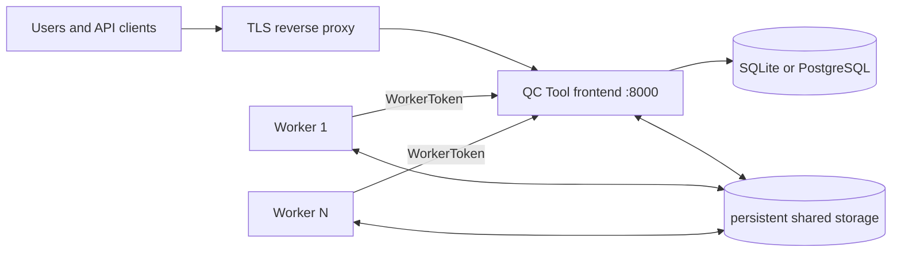

# Deployment

The files under `docker/` are deployment baselines, not universal production
manifests. Select a persistence profile, pin reviewed image tags, provide
secrets, adapt hostnames/origins, and put the frontend behind a correctly
configured HTTPS reverse proxy.

New installations start with an empty database and apply the release's committed
migrations. Transferring data from an incompatible legacy schema requires a
separate target database and a reviewed import. Read the
[cutover procedure](../../src/qc_tool/database/MIGRATIONS.md#one-time-manual-production-cutover)
before attaching persistent storage. For upgrades, choose the appropriate
[release workflow](../../src/qc_tool/database/MIGRATIONS.md#choose-the-workflow)
and follow [Operations](operations.md#upgrades).

## Choose a profile

| Profile | Frontend database | Shared storage | Appropriate for |
| --- | --- | --- | --- |
| `docker-compose.service_provider.yml` | SQLite on one named volume | one `qc_tool_volume` | one frontend, simple self-hosted installation |
| `docker-compose.eea.yml` | PostgreSQL 14 | separate DB/boundary/incoming/work/submission volumes | managed installation with external user DB lifecycle |

Both profiles support multiple worker replicas. Keep one frontend process and
one frontend container for now: the WSGI module owns a background status-refresh
thread, and the SQLite profile is not suitable for concurrent frontend writers.

## Runtime topology



The published Compose files expose port 8000 but do not provide TLS. Do not
expose that port directly to an untrusted network.

## 1. Pin and customize the manifests

Copy the selected Compose file into deployment configuration management, then:

- replace release-candidate or floating image references with approved tags or
  digests;
- set the real `DJANGO_ALLOWED_HOSTS` and `CSRF_TRUSTED_ORIGINS`;
- set the public `API_URL` when applicable;
- configure exact HTTPS `S3_ALLOWED_ENDPOINTS`, or leave S3 disabled;
- verify volume names and storage drivers;
- verify `INSPIRE_SERVICE_URL` from inside the worker;
- add the TLS/proxy-specific Django variables described below.

The checked-in EEA profile currently uses an HTTPS localhost validator URL,
while the bundled/local validator normally listens on HTTP port 8080. Treat the
deployment value as environment-specific and verify it rather than copying it
blindly.

## 2. Create a secret environment file

Store the file outside the repository with restrictive filesystem permissions.
At minimum:

```dotenv
DJANGO_SECRET_KEY=<long-random-secret>
QC_TOOL_POSTGRES_PASSWORD=<long-random-database-password>
```

`QC_TOOL_POSTGRES_PASSWORD` is required by the PostgreSQL profile. Do not add it
to a SQLite profile unnecessarily. An env file only supplies substitutions;
the Compose service must explicitly pass each application setting into its
container.

## 3. Configure TLS trust deliberately

Choose one owner for redirects and HSTS: the trusted ingress or Django.

If Django is behind a proxy that **removes any client-supplied forwarding
header and sets its own** `X-Forwarded-Proto`, pass:

```yaml
services:
  frontend:
    environment:
      DJANGO_TRUST_PROXY_SSL_HEADER: "yes"
      DJANGO_SECURE_SSL_REDIRECT: "yes"
      DJANGO_SECURE_HSTS_SECONDS: "31536000"
      DJANGO_SECURE_HSTS_INCLUDE_SUBDOMAINS: "yes"
      DJANGO_SECURE_HSTS_PRELOAD: "no"
```

Do not enable proxy trust when clients can reach Django directly or can control
that header. Enable HSTS subdomains or preload only after confirming every
affected hostname is permanently HTTPS.

Outside development/test, settings fail closed when `DJANGO_SECRET_KEY` is
missing, debug is enabled, or allowed hosts are empty/wildcarded. Secure session
and CSRF cookies default on.

## 4. Validate the rendered configuration

Use one stable project name for initial deployment and every upgrade; Compose
uses it in persistent volume names. For a legacy data cutover, use
a distinct target project and new database volumes so the old deployment stays
available for recovery. Define the deployment command once and use it for all
remaining steps. Set these values to the reviewed target environment:

```bash
QC_RELEASE_PROJECT=qc_tool_app
QC_RELEASE_ENV_FILE=/secure/path/qc-tool.env
QC_RELEASE_COMPOSE_FILE=docker/docker-compose.eea.yml

qc_compose() {
  docker compose \
    --project-name "$QC_RELEASE_PROJECT" \
    --env-file "$QC_RELEASE_ENV_FILE" \
    -f "$QC_RELEASE_COMPOSE_FILE" \
    "$@"
}

qc_compose config --quiet
```

Inspect the full rendered configuration as well. Confirm there are no demo-user
or development-server flags and no accidental host bind mounts.

## 5. Pull and initialize the database

Production images must use the frozen `released` database policy. A `draft`
policy refuses production database commands; complete the
[release freeze](../../src/qc_tool/database/MIGRATIONS.md#freeze-the-first-release)
before production deployment.
Prepare the [release record](../../src/qc_tool/database/MIGRATIONS.md#release-record)
from the [template](../../src/qc_tool/database/RELEASE_TEMPLATE.md)
before running this sequence. These commands initialize an empty installation
or a separate manual-cutover target; later upgrades follow the
[online or maintenance workflow](operations.md#upgrades).

```bash
qc_compose pull

qc_compose up --detach userdb

qc_compose exec -T userdb pg_isready --username qc_user --dbname qc_tool
```

Wait for `pg_isready` to succeed. The SQLite profile has no `userdb` service;
skip those two commands for that profile and retain its persistent frontend
volume. Apply migrations once with the same pinned frontend image that will
serve traffic:

```bash
qc_compose run --rm --no-deps frontend \
  python3 -m qc_tool.frontend.manage database plan
```

Review the plan against the release record and confirm the target is the new
database. Only then apply it:

```bash
qc_compose run --rm --no-deps frontend \
  python3 -m qc_tool.frontend.manage database apply --traceback
```

The command overrides normal frontend startup. Stop on any error and follow
[failure and recovery](../../src/qc_tool/database/MIGRATIONS.md#failure-and-recovery).
Keep detailed migration output in restricted release logs. For a legacy data
cutover, complete and validate the manual data import at this point,
while frontend and workers remain stopped. For an empty installation no import
is needed. Its product catalog stays empty until an administrator uploads the
selected JSON specifications through **Products → Upload specification**.
Bundled recipe directories do not populate products at startup.

```bash
qc_compose run --rm --no-deps frontend \
  python3 -m qc_tool.frontend.manage database check
```

Continue only after this check and the release's import/data validation succeed.
Start application services:

```bash
qc_compose up --detach --scale worker=4
```

Production frontend startup checks for pending migrations and collects static
files before Gunicorn. It refuses to start when migrations are pending; the
deployment job owns their application. Never generate migrations in a release
container. `QC_TOOL_MIGRATE_ON_STARTUP=yes` is reserved for development/test.

## 6. Verify

```bash
qc_compose ps

qc_compose exec frontend python3 -m qc_tool.frontend.manage check --deploy
```

Review every reported item. If the trusted ingress—not Django—owns SSL redirect
or HSTS, document that control rather than enabling conflicting Django settings
merely to silence a check. No other warning should be accepted without an
explicit risk decision.

Record the migration result and the following checks in the release record.
Verify through the public HTTPS hostname:

- login renders and POST login works;
- static assets load;
- HTTP redirects to HTTPS when that is the chosen topology;
- session and CSRF cookies are Secure;
- logout is a CSRF-protected POST;
- API documentation loads without a credential;
- private endpoints reject anonymous users;
- worker and database are healthy.

## 7. Bootstrap administration and boundaries

Create the first superuser interactively:

```bash
qc_compose exec frontend python3 -m qc_tool.frontend.manage createsuperuser
```

Sign in, create named operator accounts, and activate an operator-supplied
boundary package before the first QC job. Never enable
`QC_TOOL_BOOTSTRAP_DEMO_USERS` or `QC_TOOL_DEV_SERVER` in production.

Continue with the [security checklist](security-checklist.md),
[operations guide](operations.md), and
[environment-variable reference](../reference/environment-variables.md).
