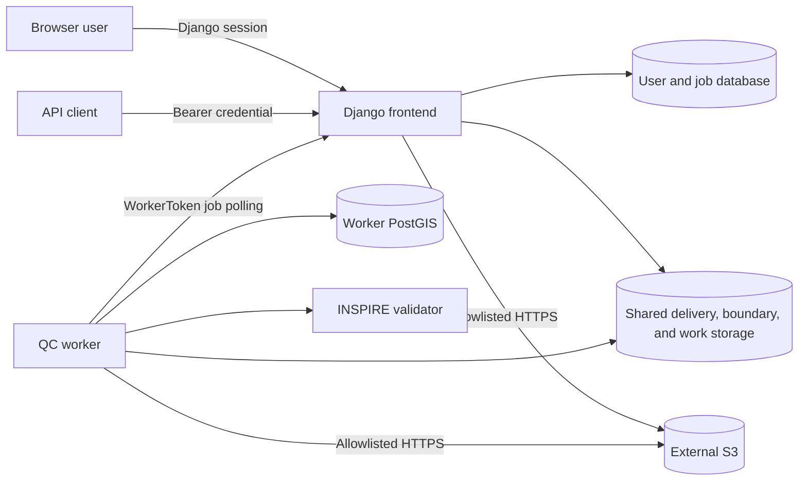

# CLMS QC Tool documentation

QC Tool validates Copernicus Land Monitoring Service deliveries against their
technical specifications. It provides a browser interface and API for
registering deliveries, queues quality-control jobs, runs those jobs in one or
more workers, and publishes machine-readable and human-readable results.

The software is maintained by Gisat for the European Environment Agency and is
licensed under [EUPL-1.2](https://github.com/eea/copernicus_quality_tools/blob/dev/LICENSE).

## Choose your path

| I want to… | Start with |
| --- | --- |
| Run the repository locally | [Getting started](getting-started/index.md) |
| Understand the system before changing it | [Architecture](architecture/index.md) |
| Work on Django, the worker, or shared services | [Development guide](development/index.md) |
| Deploy or operate QC Tool | [Deployment guide](deployment/index.md) |
| Upload deliveries and run jobs | [User guide](user-guide/index.md) |
| Manage users, roles, and scopes | [Administration](user-guide/administration.md) |
| Automate QC Tool through HTTP | [API guide](user-guide/api.md) |
| Find a setting or command | [Reference](reference/index.md) |
| Read the check catalogue | [Checks](checks/index.md) |

## Five-minute local start

From the repository root:

```bash
docker compose -f docker/compose.local.yaml up --build --detach
docker compose -f docker/compose.local.yaml ps
```

Open <http://localhost:8000/accounts/login/>. The local Compose configuration
explicitly enables development-only demo users; sign in as `admin` with
password `admin`. These credentials are refused outside development and test
environments.

Follow [Getting started](getting-started/index.md) for prerequisites, startup
verification, source-editing behavior, shutdown, and troubleshooting.

## System at a glance



The browser, API, and worker use separate authentication mechanisms. Django
permissions determine application capabilities, while delivery ownership and
product or region grants determine which records a user can see. Read the
[authentication and authorization guide](architecture/authentication-and-authorization.md)
before adding an endpoint.

## Documentation scope

This site documents the current repository. Historical wiki content may still
be useful for individual products, but it is not the source of truth for
installation, authentication, deployment, or runtime architecture.

The hosted service is available at <https://qc-copernicus.eea.europa.eu/>.
Accounts are managed by its operator; no credentials are published here.
