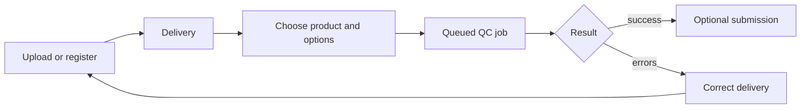

# User guide

QC Tool has no public registration. An administrator creates an account and
assigns roles, direct permissions, and optional product or region scopes.

After signing in, **Dashboard** is the default starting page. The workspace
sidebar provides **Deliveries**, **Products**, **Boundaries**, and the public
**API Access** reference. Administrators also see **Admin panel**.

The normal delivery workflow is:

1. upload a delivery ZIP or register an allowlisted S3 delivery;
2. choose the matching product definition;
3. create a QC job and optionally skip permitted steps;
4. monitor the job status;
5. inspect JSON/PDF results, logs, and attachments;
6. submit a successful delivery when submission is enabled.

## Access model

The navigation reflects server-side permissions, but hiding a control is not
the security boundary. Every page, data endpoint, and object is checked again
on the server.

- A default user works with their own deliveries and jobs.
- A product manager can read deliveries for explicitly assigned products.
- An administrator can access all products/countries and Django Admin.
- A user-specific exception can be granted as an Additional QC permission,
  optionally combined with product or region grants.

Product or region managers receive cross-user read access. Mutating another
user's delivery remains administrator-only.

## Guides

- [Deliveries and jobs](deliveries-and-jobs.md)
- [User and permission administration](administration.md)
- [API automation](api.md)
- [Check reference](../checks/index.md)
