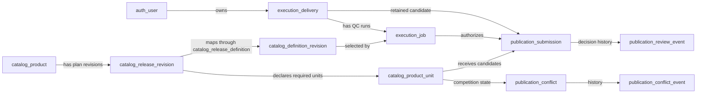

# Complete table and column dictionary

Use this document to review what every stored field means and whether it earns
its place. [SCHEMA.md](SCHEMA.md) explains the architecture;
[AUDIT.md](AUDIT.md#remaining-release-checklist) tracks the remaining release
steps and records completed cleanup and deliberately deferred schema changes.

Verified **2026-09-21** against the **3.0.0 frozen schema**, Django **5.2.17**,
and a fresh PostgreSQL **14.23** database built from the released migration graph.
The schema has **24 tables, 193 columns, 120 constraints and 91 indexes**:
14 QC Tool tables and 10 Django tables, including `django_migrations`.
The disposable verification database contains synthetic test records; neither
the existing local development database nor production was upgraded for this
audit. Image publication and production cutover remain pending.

This is a reference, not a migration baseline or a second executable schema.
Models describe the desired schema; the frozen baselines and reviewed forward
migrations govern released installations. SQL definitions in the expandable sections describe the
fresh database, including automatically named indexes and constraints. They are
not a script for changing an existing database.

## How to read the columns

- **PostgreSQL type** is the actual physical type; `varchar(n)` is PostgreSQL's
  alias for `character varying(n)`. Most QC Tool IDs are `bigint`, while Django
  user/group/permission IDs and references to them are `integer`. Django's three
  account/role/permission join tables use `bigint` row IDs in this released schema.
- **NULL** says whether the database accepts SQL NULL. An empty string is a
  separate value. Non-NULL text can still be empty unless a listed CHECK or
  application validation forbids it. A nullable FK permits a missing link; it
  does not by itself preserve a record when the linked object is deleted.
- **ORM default** describes Django's value when a field is omitted. `required`
  means there is no usable default; `''` is an empty string; `NULL` is unknown;
  `[] (new list)` creates an independent empty JSON list. `now()` and `uuid4()`
  run in Python. `insert time`/`save time` are Django-managed timestamps; bulk
  queryset updates can bypass save-time refreshes. They are not audit logs.
- **Database defaults:** numeric identities use PostgreSQL
  `GENERATED BY DEFAULT AS IDENTITY`. No other column has a database-level
  DEFAULT in the audited schema. Raw INSERTs cannot rely on ORM defaults.
- **Relationships:** FK means foreign key. `CASCADE`, `SET_NULL` and `PROTECT`
  below are Django deletion-collector rules. PostgreSQL FKs are
  `DEFERRABLE INITIALLY DEFERRED` with default SQL `NO ACTION`; they do not
  implement Django's delete cascade. Raw SQL and bulk operations do not run all
  model/service validation. The listed SQL constraints show what PostgreSQL
  actually enforces.
- **Indexes:** primary-key and ordinary unique constraints already create
  indexes. Conditional uniqueness appears as a partial unique index. Additional
  `varchar_pattern_ops` indexes support text pattern lookup. The counts include
  those indexes, not just `Meta.indexes` declared in Python.

## Table index

| Area | Table | Columns | Main responsibility |
| --- | --- | ---: | --- |
| Accounts | [`account_api_token`](#account_api_token) | 11 | Personal API credentials and original access limits |
| Accounts | [`account_product_grant`](#account_product_grant) | 5 | User-to-product scope |
| Catalog | [`catalog_product`](#catalog_product) | 12 | Stable product and final manager readiness |
| Catalog | [`catalog_release_revision`](#catalog_release_revision) | 13 | Versioned delivery plan |
| Catalog | [`catalog_definition_revision`](#catalog_definition_revision) | 7 | Immutable executable specification revision |
| Catalog | [`catalog_release_definition`](#catalog_release_definition) | 4 | Exact specifications used by a release |
| Catalog | [`catalog_product_unit`](#catalog_product_unit) | 6 | Required or draft units in a release |
| Execution | [`execution_delivery`](#execution_delivery) | 13 | User input/upload and current display projections |
| Execution | [`execution_job`](#execution_job) | 21 | One QC run and its provenance |
| Storage | [`storage_delivery_source`](#storage_delivery_source) | 5 | Remote input coordinates and credentials |
| Publication | [`publication_submission`](#publication_submission) | 24 | Retained publication receipt and current review state |
| Publication | [`publication_conflict`](#publication_conflict) | 11 | Current competition between candidates |
| Publication | [`publication_conflict_event`](#publication_conflict_event) | 9 | Conflict history |
| Publication | [`publication_review_event`](#publication_review_event) | 8 | Manager approval/decline history |
| Django | [`auth_user`](#auth_user) | 11 | Login accounts |
| Django | [`auth_group`](#auth_group) | 2 | Roles/groups |
| Django | [`auth_permission`](#auth_permission) | 4 | Named capabilities |
| Django | [`auth_user_groups`](#auth_user_groups) | 3 | Account-to-role membership |
| Django | [`auth_group_permissions`](#auth_group_permissions) | 3 | Role-to-capability assignment |
| Django | [`auth_user_user_permissions`](#auth_user_user_permissions) | 3 | Direct account capabilities |
| Django | [`django_content_type`](#django_content_type) | 3 | Model identity registry |
| Django | [`django_session`](#django_session) | 3 | Temporary browser sessions |
| Django | [`django_admin_log`](#django_admin_log) | 8 | Administration history |
| Django | [`django_migrations`](#django_migrations) | 4 | Applied migration history |

All 24 tables are part of the released inventory. `AccountCapability` is
deliberately unmanaged and creates permissions, not a 25th table.

## Main business relationships

A unit can have several candidates, but at most one **published and accepted**
candidate. A successful job does not prove publication; publication does not
mean acceptance; full accepted coverage still requires a manager's final
product-readiness action. The column-level FK and uniqueness rules below are
more precise than this overview.

## Accounts

### `account_api_token`

Purpose: named personal API credentials, storing a digest instead of the raw secret and an issuance-time limit on access. [Model](../frontend/accounts/models/api_tokens.py).

| Column | PostgreSQL type | NULL | ORM default | Meaning |
| --- | --- | --- | --- | --- |
| `id` | `bigint` | No | `identity` | Token identifier used for management and request audit snapshots. |
| `user_id` | `integer` | No | `required` | Token owner; deleting the user through the ORM deletes their tokens. |
| `name` | `varchar(80)` | No | `''` | User-facing token label, unique within the owner's account. |
| `secret_digest` | `varchar(71)` | No | `''` | Unique `sha256$`-prefixed hash used to authenticate a high-entropy bearer credential; never the raw token. |
| `token_hint` | `varchar(16)` | No | `''` | Short non-secret display hint to help identify the credential after its raw value is shown once. |
| `permission_snapshot` | `jsonb` | No | `[] (new list)` | JSON list of application permission strings available when the token was issued. Live permissions are intersected with this list. |
| `role_snapshot` | `jsonb` | No | `[] (new list)` | JSON list of canonical roles at issuance; limits the token's role-dependent behavior. |
| `product_idents_snapshot` | `jsonb` | No | `[] (new list)` | JSON list of assigned product/definition identifiers at issuance; limits product access. |
| `is_administrator_snapshot` | `boolean` | No | `False` | Whether this token was issued with administrator scope; live administrator status alone cannot broaden an older token. |
| `created_at` | `timestamp with time zone` | No | `insert time` | Issuance time, for account management and audit. |
| `last_used_at` | `timestamp with time zone` | Yes | `NULL` | Most recently recorded successful authentication; updates are throttled to at most once per five minutes. NULL means no use has been recorded. |

Keys and indexes: Primary key `id`; unique `secret_digest`; `account_token_user_name_uniq` enforces unique `(user_id, name)`; `account_token_name_not_empty` rejects empty token names. The user/name unique index covers user lookup.

Relationships: `user_id` → `auth_user.id` (ORM `CASCADE`). PostgreSQL foreign keys use deferred `NO ACTION`; the named delete behavior is enforced by Django ORM deletion.

Keep: the snapshot columns deliberately duplicate **past** account state. They stop newly granted rights from silently broadening old tokens; revoking current rights still narrows tokens immediately. All snapshots are read during authentication. `last_used_at` is approximate activity metadata, not a per-request access log. See [API authentication](../frontend/accounts/authentication/api_keys.py) and [snapshot intersection](../frontend/accounts/authorization/access.py).

Exact PostgreSQL constraints and indexes (5 constraints, 4 indexes)

| Foreign-key column | Referenced column | Django deletion rule |
| --- | --- | --- |
| `user_id` | `auth_user.id` | `CASCADE` |

| Constraint | PostgreSQL definition |
| --- | --- |
| `account_api_token_pkey` | `PRIMARY KEY (id)` |
| `account_api_token_secret_digest_key` | `UNIQUE (secret_digest)` |
| `account_api_token_user_id_c4c5b3d1_fk_auth_user_id` | `FOREIGN KEY (user_id) REFERENCES auth_user(id) DEFERRABLE INITIALLY DEFERRED` |
| `account_token_name_not_empty` | `CHECK ((NOT ((name)::text = ''::text)))` |
| `account_token_user_name_uniq` | `UNIQUE (user_id, name)` |

| Index | PostgreSQL definition |
| --- | --- |
| `account_api_token_pkey` | `CREATE UNIQUE INDEX account_api_token_pkey ON public.account_api_token USING btree (id)` |
| `account_api_token_secret_digest_86ccb746_like` | `CREATE INDEX account_api_token_secret_digest_86ccb746_like ON public.account_api_token USING btree (secret_digest varchar_pattern_ops)` |
| `account_api_token_secret_digest_key` | `CREATE UNIQUE INDEX account_api_token_secret_digest_key ON public.account_api_token USING btree (secret_digest)` |
| `account_token_user_name_uniq` | `CREATE UNIQUE INDEX account_token_user_name_uniq ON public.account_api_token USING btree (user_id, name)` |

### `account_product_grant`

Purpose: assign one explicit product scope to one user, shared by default users and product managers. [Model](../frontend/accounts/models/product_grants.py).

| Column | PostgreSQL type | NULL | ORM default | Meaning |
| --- | --- | --- | --- | --- |
| `id` | `bigint` | No | `identity` | Internal assignment identifier. |
| `user_id` | `integer` | No | `required` | Account receiving the product scope. |
| `product_ident` | `varchar(64)` | No | `''` | Canonical textual identifier of either a business product or an explicitly scoped QC definition. Unique per user. It is intentionally not a foreign key to a single catalog table. |
| `created_at` | `timestamp with time zone` | No | `insert time` | When this assignment was created. |
| `created_by_id` | `integer` | Yes | `NULL` | Account that made the assignment, when known; nullable for operator/import/system-created grants and after grantor deletion. |

Keys and indexes: Primary key `id`; `account_product_user_key_uniq` enforces unique `(user_id, product_ident)`; `account_product_key_not_empty` rejects an empty identifier. `account_product_ident_idx` supports reverse product-scope lookup; the composite unique index covers user lookup.

Relationships: `user_id` → `auth_user.id` (ORM `CASCADE`); `created_by_id` → `auth_user.id` (ORM `SET_NULL`). PostgreSQL foreign keys use deferred `NO ACTION`; the named delete behavior is enforced by Django ORM deletion.

Decision: retain a canonical textual scope identifier, with explicit model/admin help explaining business-product versus exact-definition scope. A business-product grant and a definition-only grant are not interchangeable; services calculate browsing, QC and review scope separately, including grouped products. A single product foreign key would lose those distinctions and historical unresolved assignments. See [grant scope resolution](../frontend/accounts/services/products.py).

Exact PostgreSQL constraints and indexes (5 constraints, 4 indexes)

| Foreign-key column | Referenced column | Django deletion rule |
| --- | --- | --- |
| `user_id` | `auth_user.id` | `CASCADE` |
| `created_by_id` | `auth_user.id` | `SET_NULL` |

| Constraint | PostgreSQL definition |
| --- | --- |
| `account_product_grant_created_by_id_6ee22944_fk_auth_user_id` | `FOREIGN KEY (created_by_id) REFERENCES auth_user(id) DEFERRABLE INITIALLY DEFERRED` |
| `account_product_grant_pkey` | `PRIMARY KEY (id)` |
| `account_product_grant_user_id_1aae55f3_fk_auth_user_id` | `FOREIGN KEY (user_id) REFERENCES auth_user(id) DEFERRABLE INITIALLY DEFERRED` |
| `account_product_key_not_empty` | `CHECK ((NOT ((product_ident)::text = ''::text)))` |
| `account_product_user_key_uniq` | `UNIQUE (user_id, product_ident)` |

| Index | PostgreSQL definition |
| --- | --- |
| `account_product_grant_created_by_id_6ee22944` | `CREATE INDEX account_product_grant_created_by_id_6ee22944 ON public.account_product_grant USING btree (created_by_id)` |
| `account_product_grant_pkey` | `CREATE UNIQUE INDEX account_product_grant_pkey ON public.account_product_grant USING btree (id)` |
| `account_product_ident_idx` | `CREATE INDEX account_product_ident_idx ON public.account_product_grant USING btree (product_ident)` |
| `account_product_user_key_uniq` | `CREATE UNIQUE INDEX account_product_user_key_uniq ON public.account_product_grant USING btree (user_id, product_ident)` |

## Catalog

### `catalog_product`

Purpose: stable business product, independent of individual specification revisions, with the manager's final readiness confirmation. [Model](../frontend/dashboard/domain/catalog/product.py).

| Column | PostgreSQL type | NULL | ORM default | Meaning |
| --- | --- | --- | --- | --- |
| `id` | `bigint` | No | `identity` | Internal stable product identifier referenced by release revisions. |
| `ident` | `varchar(64)` | No | `''` | Unique canonical business identifier used by routes and assignment scopes. |
| `name` | `varchar(200)` | No | `''` | Human-readable product name. May differ from individual QC-definition descriptions in grouped products. |
| `description` | `varchar(500)` | No | `''` | Business-level product explanation; may be empty. |
| `is_active` | `boolean` | No | `True` | Whether the product is available for active workflows. False represents stopped/archived use while retaining history. It does not mean completed. |
| `readiness_revision` | `integer` | No | `0` | Incrementing invalidation counter when coverage/acceptance changes. Prevents an old confirmation becoming valid again merely because a previous-looking state returns. |
| `ready_at` | `timestamp with time zone` | Yes | `NULL` | Time of explicit final manager/administrator readiness confirmation; NULL when not confirmed or invalidated. |
| `ready_by_id` | `integer` | Yes | `NULL` | Account that made the final confirmation; nullable after account deletion. |
| `ready_by_username` | `varchar(150)` | No | `''` | Actor-name snapshot that preserves the meaning of the readiness confirmation when the account changes or is detached. |
| `ready_scope_digest` | `varchar(64)` | No | `''` | SHA-256 fingerprint binding confirmation to the current required scope and accepted-candidate state. |
| `created_at` | `timestamp with time zone` | No | `insert time` | When the business product was created in this catalog. |
| `updated_at` | `timestamp with time zone` | No | `save time` | Last model-save timestamp for this product. Some queryset updates bypass it; it is not a complete audit history. |

Keys and indexes: Primary key `id`; unique `ident`; `catalog_product_ident_present` and `catalog_product_name_present` reject empty identifiers/names; the positive-integer field adds a nonnegative check for `readiness_revision`.

Relationships: `ready_by_id` → `auth_user.id` (ORM `SET_NULL`). PostgreSQL foreign keys use deferred `NO ACTION`; the named delete behavior is enforced by Django ORM deletion.

Keep: readiness is not derivable from accepted-unit counts alone because a final manager action is required. The counter and digest protect against stale confirmations. `ready_by_id` and `ready_by_username` are a live relationship and a historical snapshot, respectively. Product lists derive Draft/Active/Stopped/Completed from product/release/readiness facts rather than storing a second independent status column. See [readiness service](../frontend/dashboard/services/catalog/readiness.py).

Exact PostgreSQL constraints and indexes (6 constraints, 4 indexes)

| Foreign-key column | Referenced column | Django deletion rule |
| --- | --- | --- |
| `ready_by_id` | `auth_user.id` | `SET_NULL` |

| Constraint | PostgreSQL definition |
| --- | --- |
| `catalog_product_ident_key` | `UNIQUE (ident)` |
| `catalog_product_ident_present` | `CHECK ((NOT ((ident)::text = ''::text)))` |
| `catalog_product_name_present` | `CHECK ((NOT ((name)::text = ''::text)))` |
| `catalog_product_pkey` | `PRIMARY KEY (id)` |
| `catalog_product_readiness_revision_check` | `CHECK ((readiness_revision >= 0))` |
| `catalog_product_ready_by_id_e2294a21_fk_auth_user_id` | `FOREIGN KEY (ready_by_id) REFERENCES auth_user(id) DEFERRABLE INITIALLY DEFERRED` |

| Index | PostgreSQL definition |
| --- | --- |
| `catalog_product_ident_0b8a7082_like` | `CREATE INDEX catalog_product_ident_0b8a7082_like ON public.catalog_product USING btree (ident varchar_pattern_ops)` |
| `catalog_product_ident_key` | `CREATE UNIQUE INDEX catalog_product_ident_key ON public.catalog_product USING btree (ident)` |
| `catalog_product_pkey` | `CREATE UNIQUE INDEX catalog_product_pkey ON public.catalog_product USING btree (id)` |
| `catalog_product_ready_by_id_e2294a21` | `CREATE INDEX catalog_product_ready_by_id_e2294a21 ON public.catalog_product USING btree (ready_by_id)` |

### `catalog_release_revision`

Purpose: one immutable revision of a product's delivery plan and linked executable specifications. "Release" here means a product plan revision, not a QC Tool software release. [Model](../frontend/dashboard/domain/catalog/product_release.py).

| Column | PostgreSQL type | NULL | ORM default | Meaning |
| --- | --- | --- | --- | --- |
| `id` | `bigint` | No | `identity` | Internal revision identifier retained by jobs, required units and submission receipts. |
| `product_id` | `bigint` | No | `required` | Business product owning this release stream. |
| `release_key` | `varchar(100)` | No | `''` | Stable identifier for a release stream across its revisions; globally scoped. A product may have more than one stream. |
| `revision` | `integer` | No | `required` | Positive revision number within `release_key`. |
| `description` | `varchar(500)` | No | `''` | Human-readable explanation of this particular release scope. |
| `catalog_digest` | `varchar(64)` | No | `''` | Content fingerprint of the normalized release plan, including definition identities and expected coverage; supports change detection and readiness validation. |
| `source_kind` | `varchar(20)` | No | `'manifest'` | Ownership/provenance of the plan: `definition` for explicit directory import, `upload` for browser upload, or `manifest` for reviewed manifest. Prevents one source workflow silently taking over another. |
| `coverage_state` | `varchar(20)` | No | `'unknown'` | `unknown`, `draft`, `authoritative`, or `retired`. Only approved authoritative, current, nonempty scopes can authorize final submission and contribute a completion denominator. |
| `is_current` | `boolean` | No | `False` | Which revision currently represents this stream. At most one current row per `release_key`. Historical rows remain retained. |
| `supersedes_id` | `bigint` | Yes | `NULL` | Previous revision in the stream, if any. Forms an explicit history chain; a revision can have at most one direct successor. |
| `created_at` | `timestamp with time zone` | No | `insert time` | Time this revision was registered. |
| `approved_at` | `timestamp with time zone` | Yes | `NULL` | Time the delivery scope became authoritative. Required for authoritative coverage; this is plan approval, not final product readiness. |
| `approved_by_id` | `integer` | Yes | `NULL` | Administrator that approved a plan through the application, when known. Reviewed operator imports may have no linked account; deleting that account may also clear the reference. |

Keys and indexes: Primary key `id`; `catalog_release_revision_uniq` enforces `(release_key, revision)` uniqueness; `catalog_release_current_uniq` is a partial unique index allowing at most one `is_current = true` row per stream; unique `supersedes_id` permits at most one direct successor. `catalog_release_state_valid` and `catalog_release_source_valid` constrain the enumerated states; `catalog_release_approved` requires `approved_at` for authoritative scopes; `catalog_release_key_present`, `catalog_release_revision_gt0` and `catalog_release_digest_present` enforce required identity. `catalog_release_coverage_idx` indexes `(product_id, coverage_state, is_current)`.

Relationships: `product_id` → `catalog_product.id` (ORM `PROTECT`); `supersedes_id` → `catalog_release_revision.id` (ORM `PROTECT`); `approved_by_id` → `auth_user.id` (ORM `SET_NULL`). PostgreSQL foreign keys use deferred `NO ACTION`; the named delete behavior is enforced by Django ORM deletion.

Keep: a changed plan creates a revision so old jobs and receipts still identify the plan they used. `revision`, `supersedes_id` and `is_current` describe sequence, lineage and current selection rather than three copies of one status. Review naming/documentation for `approved_at` versus `catalog_product.ready_at` so plan approval is never confused with acceptance or completion. A referenced approver name is not separately snapshotted here; the catalog admin log provides additional workflow audit records. See [release creation](../frontend/dashboard/services/catalog/sync/release_records.py) and [plan approval](../frontend/dashboard/services/catalog/delivery_plans.py).

Exact PostgreSQL constraints and indexes (13 constraints, 6 indexes)

| Foreign-key column | Referenced column | Django deletion rule |
| --- | --- | --- |
| `product_id` | `catalog_product.id` | `PROTECT` |
| `supersedes_id` | `catalog_release_revision.id` | `PROTECT` |
| `approved_by_id` | `auth_user.id` | `SET_NULL` |

| Constraint | PostgreSQL definition |
| --- | --- |
| `catalog_release_approved` | `CHECK (((NOT ((coverage_state)::text = 'authoritative'::text)) OR (approved_at IS NOT NULL)))` |
| `catalog_release_digest_present` | `CHECK ((NOT ((catalog_digest)::text = ''::text)))` |
| `catalog_release_key_present` | `CHECK ((NOT ((release_key)::text = ''::text)))` |
| `catalog_release_revi_approved_by_id_a7469d43_fk_auth_user` | `FOREIGN KEY (approved_by_id) REFERENCES auth_user(id) DEFERRABLE INITIALLY DEFERRED` |
| `catalog_release_revi_product_id_89e20dba_fk_catalog_p` | `FOREIGN KEY (product_id) REFERENCES catalog_product(id) DEFERRABLE INITIALLY DEFERRED` |
| `catalog_release_revi_supersedes_id_2f7ba06a_fk_catalog_r` | `FOREIGN KEY (supersedes_id) REFERENCES catalog_release_revision(id) DEFERRABLE INITIALLY DEFERRED` |
| `catalog_release_revision_gt0` | `CHECK ((revision > 0))` |
| `catalog_release_revision_pkey` | `PRIMARY KEY (id)` |
| `catalog_release_revision_revision_check` | `CHECK ((revision >= 0))` |
| `catalog_release_revision_supersedes_id_key` | `UNIQUE (supersedes_id)` |
| `catalog_release_revision_uniq` | `UNIQUE (release_key, revision)` |
| `catalog_release_source_valid` | `CHECK (((source_kind)::text = ANY ((ARRAY['definition'::character varying, 'manifest'::character varying, 'upload'::character varying])::text[])))` |
| `catalog_release_state_valid` | `CHECK (((coverage_state)::text = ANY ((ARRAY['unknown'::character varying, 'draft'::character varying, 'authoritative'::character varying, 'retired'::character varying])::text[])))` |

| Index | PostgreSQL definition |
| --- | --- |
| `catalog_release_coverage_idx` | `CREATE INDEX catalog_release_coverage_idx ON public.catalog_release_revision USING btree (product_id, coverage_state, is_current)` |
| `catalog_release_current_uniq` | `CREATE UNIQUE INDEX catalog_release_current_uniq ON public.catalog_release_revision USING btree (release_key) WHERE is_current` |
| `catalog_release_revision_approved_by_id_a7469d43` | `CREATE INDEX catalog_release_revision_approved_by_id_a7469d43 ON public.catalog_release_revision USING btree (approved_by_id)` |
| `catalog_release_revision_pkey` | `CREATE UNIQUE INDEX catalog_release_revision_pkey ON public.catalog_release_revision USING btree (id)` |
| `catalog_release_revision_supersedes_id_key` | `CREATE UNIQUE INDEX catalog_release_revision_supersedes_id_key ON public.catalog_release_revision USING btree (supersedes_id)` |
| `catalog_release_revision_uniq` | `CREATE UNIQUE INDEX catalog_release_revision_uniq ON public.catalog_release_revision USING btree (release_key, revision)` |

### `catalog_definition_revision`

Purpose: an immutable parsed copy of one executable product-specification revision, tied to the original file bytes by digest. [Model](../frontend/dashboard/domain/catalog/qc_definition.py).

| Column | PostgreSQL type | NULL | ORM default | Meaning |
| --- | --- | --- | --- | --- |
| `id` | `bigint` | No | `identity` | Internal definition revision identifier used by release links and jobs. |
| `product_ident` | `varchar(64)` | No | `''` | Canonical specification filename stem, distinct from a grouped business-product identifier. |
| `digest` | `varchar(64)` | No | `''` | SHA-256 of the original specification file bytes; paired with `product_ident` to identify a revision. Whitespace changes in the original file can therefore produce a different digest. |
| `description` | `varchar(500)` | No | `''` | Parsed top-level specification description, duplicated as a relational field for labels and queries. |
| `document` | `jsonb` | No | `required` | Complete parsed specification JSON, stored as PostgreSQL JSONB. It is not a byte-exact original file and does not preserve formatting/key order. |
| `source_path` | `varchar(500)` | No | `''` | First import location or source marker, for example `upload:<ident>.json`. Provenance only; it is not a promise that a file remains at that path. |
| `imported_at` | `timestamp with time zone` | No | `insert time` | Time the immutable definition revision was first registered. |

Keys and indexes: Primary key `id`; `catalog_def_ident_digest_uniq` enforces `(product_ident, digest)` uniqueness; `catalog_def_ident_present` and `catalog_def_digest_present` reject empty identity values. `catalog_def_ident_date_idx` indexes `(product_ident, imported_at DESC)` for revision lookup.

Relationships: no foreign keys.

Keep `document` and `digest`: the JSON is executable/queryable content, while the digest establishes exact source identity. Original bytes remain in shared version-file storage and must never be reconstructed by reserializing JSONB. The description is an intentional denormalized label and can be reviewed as an optimization choice, but its current query/display consumers must be updated if removed. Review whether the operational provenance of `source_path` is useful to operators; it is retained through plan reconstruction and shown in admin, but file retrieval is not based on this string. See [definition parsing](../frontend/dashboard/services/catalog/manifest/definitions.py), [revision storage](../frontend/dashboard/services/catalog/revisions.py) and [specification upload](../frontend/dashboard/services/catalog/specification_upload.py).

Exact PostgreSQL constraints and indexes (4 constraints, 3 indexes)

| Constraint | PostgreSQL definition |
| --- | --- |
| `catalog_def_digest_present` | `CHECK ((NOT ((digest)::text = ''::text)))` |
| `catalog_def_ident_digest_uniq` | `UNIQUE (product_ident, digest)` |
| `catalog_def_ident_present` | `CHECK ((NOT ((product_ident)::text = ''::text)))` |
| `catalog_definition_revision_pkey` | `PRIMARY KEY (id)` |

| Index | PostgreSQL definition |
| --- | --- |
| `catalog_def_ident_date_idx` | `CREATE INDEX catalog_def_ident_date_idx ON public.catalog_definition_revision USING btree (product_ident, imported_at DESC)` |
| `catalog_def_ident_digest_uniq` | `CREATE UNIQUE INDEX catalog_def_ident_digest_uniq ON public.catalog_definition_revision USING btree (product_ident, digest)` |
| `catalog_definition_revision_pkey` | `CREATE UNIQUE INDEX catalog_definition_revision_pkey ON public.catalog_definition_revision USING btree (id)` |

### `catalog_release_definition`

Purpose: explicit many-to-many association between a release revision and its exact executable definition revisions. [Model](../frontend/dashboard/domain/catalog/product_release_definition.py).

| Column | PostgreSQL type | NULL | ORM default | Meaning |
| --- | --- | --- | --- | --- |
| `id` | `bigint` | No | `identity` | Internal relationship identifier. |
| `product_release_id` | `bigint` | No | `required` | Release revision using the definition. |
| `qc_definition_id` | `bigint` | No | `required` | Exact immutable definition revision approved for that release. |
| `is_primary` | `boolean` | No | `False` | Marks the release's primary definition for selection/presentation. At most one primary link per release. |

Keys and indexes: Primary key `id`; `catalog_release_def_uniq` enforces `(product_release_id, qc_definition_id)` uniqueness; `catalog_release_primary_uniq` is a partial unique index allowing at most one primary link per release. The pair index covers release lookup; a separate foreign-key index covers `qc_definition_id`.

Relationships: `product_release_id` → `catalog_release_revision.id` (ORM `PROTECT`); `qc_definition_id` → `catalog_definition_revision.id` (ORM `PROTECT`). PostgreSQL foreign keys use deferred `NO ACTION`; the named delete behavior is enforced by Django ORM deletion.

Keep: one product plan may group several specifications, and one specification can be used in multiple releases. Joining by filename guesses would lose these relationships. The database prevents two primary links but does not itself require at least one; the plan service validates exactly one when approving a delivery plan. See [definition selection for plan approval](../frontend/dashboard/services/catalog/delivery_plans.py).

Exact PostgreSQL constraints and indexes (4 constraints, 4 indexes)

| Foreign-key column | Referenced column | Django deletion rule |
| --- | --- | --- |
| `product_release_id` | `catalog_release_revision.id` | `PROTECT` |
| `qc_definition_id` | `catalog_definition_revision.id` | `PROTECT` |

| Constraint | PostgreSQL definition |
| --- | --- |
| `catalog_release_def_uniq` | `UNIQUE (product_release_id, qc_definition_id)` |
| `catalog_release_defi_product_release_id_cd9cabfe_fk_catalog_r` | `FOREIGN KEY (product_release_id) REFERENCES catalog_release_revision(id) DEFERRABLE INITIALLY DEFERRED` |
| `catalog_release_defi_qc_definition_id_14154bd5_fk_catalog_d` | `FOREIGN KEY (qc_definition_id) REFERENCES catalog_definition_revision(id) DEFERRABLE INITIALLY DEFERRED` |
| `catalog_release_definition_pkey` | `PRIMARY KEY (id)` |

| Index | PostgreSQL definition |
| --- | --- |
| `catalog_release_def_uniq` | `CREATE UNIQUE INDEX catalog_release_def_uniq ON public.catalog_release_definition USING btree (product_release_id, qc_definition_id)` |
| `catalog_release_definition_pkey` | `CREATE UNIQUE INDEX catalog_release_definition_pkey ON public.catalog_release_definition USING btree (id)` |
| `catalog_release_definition_qc_definition_id_14154bd5` | `CREATE INDEX catalog_release_definition_qc_definition_id_14154bd5 ON public.catalog_release_definition USING btree (qc_definition_id)` |
| `catalog_release_primary_uniq` | `CREATE UNIQUE INDEX catalog_release_primary_uniq ON public.catalog_release_definition USING btree (product_release_id) WHERE is_primary` |

### `catalog_product_unit`

Purpose: one required or draft product unit in an exact release revision. It describes expected delivery coverage, not geography by itself and not an uploaded delivery. [Model](../frontend/dashboard/domain/catalog/product_unit.py).

| Column | PostgreSQL type | NULL | ORM default | Meaning |
| --- | --- | --- | --- | --- |
| `id` | `bigint` | No | `identity` | Internal expected-unit identifier referenced by publication records. |
| `product_release_id` | `bigint` | No | `required` | Release revision whose plan contains the unit. |
| `product_unit_code` | `varchar(255)` | No | `''` | Canonical opaque business-unit code, unique within the release. Normalization preserves numeric padding and product-specific suffixes; geographic specification inputs are adapted at their input boundary. |
| `source_value` | `varchar(255)` | No | `''` | Original declared spelling/value before canonical normalization. Useful when checking why a specification/plan value became this unit code. |
| `provenance` | `varchar(100)` | No | `''` | Source of the declaration: current writers use `definition`, `manifest` or `administrator`. |
| `created_at` | `timestamp with time zone` | No | `insert time` | Time this unit row was created as part of its release revision. |

Keys and indexes: Primary key `id`; `catalog_product_unit_code_uniq` enforces `(product_release_id, product_unit_code)` uniqueness; `catalog_product_unit_code_present` rejects empty codes. `catalog_unit_code_release_idx` indexes `(product_unit_code, product_release_id)` for code-first lookups; the unique pair index covers release-first lookup.

Relationships: `product_release_id` → `catalog_release_revision.id` (ORM `PROTECT`). PostgreSQL foreign keys use deferred `NO ACTION`; the named delete behavior is enforced by Django ORM deletion.

Keep: `source_value` and canonical code can differ and preserve meaningful normalization provenance. `provenance` is read by release validation, so it is not an unused display label. Review its schema contract: current storage is free text with no choices/check constraint even though writers use a small known vocabulary. `created_at` is frequently close to the release's creation time; it has limited independent business value, but removing it is a separate deliberate schema choice, not a prerequisite for this documentation. See [unit normalization](../product_units.py), [coverage parsing](../frontend/dashboard/services/catalog/manifest/coverage.py) and [release identity validation](../frontend/dashboard/services/catalog/sync/release_validation.py).

Exact PostgreSQL constraints and indexes (4 constraints, 3 indexes)

| Foreign-key column | Referenced column | Django deletion rule |
| --- | --- | --- |
| `product_release_id` | `catalog_release_revision.id` | `PROTECT` |

| Constraint | PostgreSQL definition |
| --- | --- |
| `catalog_product_unit_code_present` | `CHECK ((NOT ((product_unit_code)::text = ''::text)))` |
| `catalog_product_unit_code_uniq` | `UNIQUE (product_release_id, product_unit_code)` |
| `catalog_product_unit_pkey` | `PRIMARY KEY (id)` |
| `catalog_product_unit_product_release_id_e31c623f_fk_catalog_r` | `FOREIGN KEY (product_release_id) REFERENCES catalog_release_revision(id) DEFERRABLE INITIALLY DEFERRED` |

| Index | PostgreSQL definition |
| --- | --- |
| `catalog_product_unit_code_uniq` | `CREATE UNIQUE INDEX catalog_product_unit_code_uniq ON public.catalog_product_unit USING btree (product_release_id, product_unit_code)` |
| `catalog_product_unit_pkey` | `CREATE UNIQUE INDEX catalog_product_unit_pkey ON public.catalog_product_unit USING btree (id)` |
| `catalog_unit_code_release_idx` | `CREATE INDEX catalog_unit_code_release_idx ON public.catalog_product_unit USING btree (product_unit_code, product_release_id)` |

## Execution and storage

### `execution_delivery`

**Purpose:** One registered input/upload revision and its owner. Its product fields are current display/filter projections; the per-run facts live in jobs. Actual files are outside PostgreSQL. Model: [Delivery](../frontend/dashboard/domain/deliveries/delivery.py).

| Column | PostgreSQL type | NULL | ORM default | Meaning |
| --- | --- | --- | --- | --- |
| `id` | `bigint` | No | `identity` | Stable delivery/upload revision identifier; primary key. |
| `user_id` | `integer` | Yes | `NULL` | Upload owner; optional FK to `auth_user.id` (ORM CASCADE). Ownership is separate from who later requests a QC job. |
| `filename` | `varchar(500)` | No | `''` | Original delivery ZIP filename or registered source label. It is not globally unique; retained revisions can share it. |
| `size_bytes` | `bigint` | No | `required` | Recorded input size in bytes, constrained to be nonnegative. |
| `date_uploaded` | `timestamp with time zone` | No | `now()` | Time this delivery was registered; defaults to application time. |
| `date_submitted` | `timestamp with time zone` | Yes | `NULL` | Recorded submission time. Publication sets it after files are retained; a timestamp alone does not prove retained files or manager approval. |
| `product_ident` | `varchar(64)` | Yes | `NULL` | Identified executable specification identifier; refreshed from the latest job when a job exists. Not a FK and not necessarily the business-product identifier. |
| `product_description` | `varchar(500)` | Yes | `NULL` | Display description captured at registration and refreshed from the latest job; remains readable when its catalog revision is unavailable. |
| `product_unit_code` | `varchar(255)` | Yes | `NULL` | Reported product-unit projection from the deterministic latest job; may be cleared while a new job is pending. Not the authoritative expected catalog unit. |
| `verified_product_unit_code` | `varchar(255)` | Yes | `NULL` | Verified ZIP unit identity retained across later waiting jobs; contradictory later results are rejected. Verification identifies ZIP content and does not imply manager approval. |
| `content_sha256` | `varchar(64)` | Yes | `NULL` | Known input SHA-256 checksum. Publication checks it for contradictions and fills it if missing; a NULL value means unknown, not missing bytes. |
| `is_deleted` | `boolean` | No | `False` | Visibility/retirement flag. Also marks superseded upload revisions; does not mean that job history may be erased. |
| `s3_id` | `bigint` | Yes | `NULL` | Optional FK to `storage_delivery_source.id` (ORM CASCADE). Non-NULL selects a remote registered input rather than a local ZIP. |

**Keys and access paths.** Primary key `id`; FKs to user and S3 source have ordinary indexes. `execution_delivery_size_valid` enforces nonnegative size. Named indexes cover reported unit (`execution_delivery_unit_idx`), verified unit (`execution_delivery_zipunit_idx`) and checksum (`execution_delivery_sha_idx`). There is deliberately no unique filename constraint.

**Review note.** Latest-job product fields are maintained by [projections.py](../frontend/dashboard/services/product_units/projections.py). The verified unit is sticky across new waiting jobs. `date_submitted` records the submission event used by current delivery lists and lifecycle checks; retained publication receipts independently prove the files and approval state. `is_deleted` also retains replaced revisions, as described in [overwrite.py](../frontend/dashboard/services/uploads/overwrite.py).

Exact PostgreSQL constraints and indexes (4 constraints, 6 indexes)

| Foreign-key column | Referenced column | Django deletion rule |
| --- | --- | --- |
| `user_id` | `auth_user.id` | `CASCADE` |
| `s3_id` | `storage_delivery_source.id` | `CASCADE` |

| Constraint | PostgreSQL definition |
| --- | --- |
| `execution_delivery_pkey` | `PRIMARY KEY (id)` |
| `execution_delivery_s3_id_80df5506_fk_storage_delivery_source_id` | `FOREIGN KEY (s3_id) REFERENCES storage_delivery_source(id) DEFERRABLE INITIALLY DEFERRED` |
| `execution_delivery_size_valid` | `CHECK ((size_bytes >= 0))` |
| `execution_delivery_user_id_0df519b0_fk_auth_user_id` | `FOREIGN KEY (user_id) REFERENCES auth_user(id) DEFERRABLE INITIALLY DEFERRED` |

| Index | PostgreSQL definition |
| --- | --- |
| `execution_delivery_pkey` | `CREATE UNIQUE INDEX execution_delivery_pkey ON public.execution_delivery USING btree (id)` |
| `execution_delivery_s3_id_80df5506` | `CREATE INDEX execution_delivery_s3_id_80df5506 ON public.execution_delivery USING btree (s3_id)` |
| `execution_delivery_sha_idx` | `CREATE INDEX execution_delivery_sha_idx ON public.execution_delivery USING btree (content_sha256)` |
| `execution_delivery_unit_idx` | `CREATE INDEX execution_delivery_unit_idx ON public.execution_delivery USING btree (product_unit_code)` |
| `execution_delivery_user_id_0df519b0` | `CREATE INDEX execution_delivery_user_id_0df519b0 ON public.execution_delivery USING btree (user_id)` |
| `execution_delivery_zipunit_idx` | `CREATE INDEX execution_delivery_zipunit_idx ON public.execution_delivery USING btree (verified_product_unit_code)` |

### `execution_job`

**Purpose:** One QC execution. Retains request, selected specification/release, execution state and worker-result provenance. A delivery may be run repeatedly. Model: [Job](../frontend/dashboard/domain/jobs/job.py).

| Column | PostgreSQL type | NULL | ORM default | Meaning |
| --- | --- | --- | --- | --- |
| `job_uuid` | `uuid` | No | `uuid4()` | Stable UUID for one QC run; primary key and worker/artifact identifier. |
| `delivery_id` | `bigint` | No | `required` | Input delivery FK to `execution_delivery.id` (ORM CASCADE). One delivery can have many jobs. |
| `date_created` | `timestamp with time zone` | No | `now()` | Time the QC request entered the queue. |
| `date_started` | `timestamp with time zone` | Yes | `NULL` | Time a worker claimed the job; NULL until started or when unknown in historical data. |
| `date_finished` | `timestamp with time zone` | Yes | `NULL` | Time terminal completion was recorded; NULL before completion or when unknown. |
| `job_status` | `varchar(64)` | No | `'waiting'` | Execution state: current constants are `waiting`, `running`, `ok`, `partial`, `failed`, `error`, `worker timeout`, `worker lost`. These values have no database CHECK constraint. |
| `product_ident` | `varchar(64)` | No | `''` | Executable specification identifier selected for this run; historical text remains even if no linked revision exists. |
| `product_description` | `varchar(500)` | No | `''` | Specification description captured for this run, independent of later catalog wording. |
| `product_unit_code` | `varchar(255)` | Yes | `NULL` | Normalized unit reported by the worker result; a reported unit can be retained without verified identity. |
| `verified_product_unit_code` | `varchar(255)` | Yes | `NULL` | Unit treated by the QC workflow as verified from this job's ZIP. Current result processing writes the same normalized value to both job unit columns; a reported observation alone never proves ZIP verification. |
| `skip_steps` | `varchar(100)` | Yes | `NULL` | Comma-separated selected QC step numbers omitted from this run; NULL/empty means no omissions. |
| `worker_url` | `varchar(500)` | Yes | `NULL` | Internal worker origin assigned at claim time; used for status/result polling, excluded from public history serialization. |
| `requested_by_id` | `integer` | Yes | `NULL` | Optional requesting-account FK to `auth_user.id` (ORM SET_NULL). Not necessarily the delivery owner. |
| `requested_by_username` | `varchar(150)` | No | `''` | Requester username snapshot retained if the account is renamed or detached. |
| `request_source` | `varchar(16)` | Yes | `NULL` | Known request channel: browser or api. NULL means the origin is unknown. A CHECK rejects other values. |
| `requested_api_token_id` | `bigint` | Yes | `NULL` | Nonnegative token identifier snapshot, deliberately not a FK; credential deletion must not erase job provenance. |
| `requested_api_token_name` | `varchar(80)` | No | `''` | Token label captured when requested; contains no token secret. |
| `product_release_id` | `bigint` | Yes | `NULL` | Optional FK to the selected `catalog_release_revision.id` (ORM PROTECT); NULL when no authoritative revision was recorded. |
| `qc_definition_id` | `bigint` | Yes | `NULL` | Optional FK to the exact `catalog_definition_revision.id` used (ORM PROTECT); preserves specification provenance. |
| `input_sha256` | `varchar(64)` | No | `''` | Input checksum reported by the worker. Publication validates a usable SHA-256 value and compares it with copied input bytes; an empty string means unavailable. |
| `reference_period` | `varchar(32)` | No | `''` | Bounded projection of worker `reference_year`, used as a report fallback when file metadata lacks it. |

**Keys and access paths.** Primary key `job_uuid`; optional account/release/definition FKs are indexed. `execution_job_latest_idx` covers `(delivery_id, date_created DESC, job_uuid DESC)` and replaces a redundant delivery-only FK index. `execution_job_queue_idx` covers `(job_status, date_created)`. Two unit indexes cover reported and ZIP unit lookups. A positive-token-ID CHECK exists; `execution_job_source_valid` permits browser/api or NULL; job status is validated by application paths.

**Decision.** Username/token and product-description snapshots remain historical evidence. The unused `result_metadata`, `result_sha256`, `result_received_at` and job-level `qc_tool_version` columns have been removed. [Result projection](../frontend/dashboard/services/product_units/jobs/metadata.py) persists only the input hash needed for publication and the reference-period report fallback. Complete result JSON and software version remain in job artifacts and in the checksummed publication archive. No PostgreSQL result-recovery feature is claimed. The observed and verified unit fields remain distinct because imported historical observations do not prove ZIP verification.

Exact PostgreSQL constraints and indexes (7 constraints, 8 indexes)

| Foreign-key column | Referenced column | Django deletion rule |
| --- | --- | --- |
| `delivery_id` | `execution_delivery.id` | `CASCADE` |
| `requested_by_id` | `auth_user.id` | `SET_NULL` |
| `product_release_id` | `catalog_release_revision.id` | `PROTECT` |
| `qc_definition_id` | `catalog_definition_revision.id` | `PROTECT` |

| Constraint | PostgreSQL definition |
| --- | --- |
| `execution_job_delivery_id_bac949df_fk_execution_delivery_id` | `FOREIGN KEY (delivery_id) REFERENCES execution_delivery(id) DEFERRABLE INITIALLY DEFERRED` |
| `execution_job_pkey` | `PRIMARY KEY (job_uuid)` |
| `execution_job_product_release_id_b0db6a21_fk_catalog_r` | `FOREIGN KEY (product_release_id) REFERENCES catalog_release_revision(id) DEFERRABLE INITIALLY DEFERRED` |
| `execution_job_qc_definition_id_b1448905_fk_catalog_d` | `FOREIGN KEY (qc_definition_id) REFERENCES catalog_definition_revision(id) DEFERRABLE INITIALLY DEFERRED` |
| `execution_job_requested_api_token_id_check` | `CHECK ((requested_api_token_id >= 0))` |
| `execution_job_requested_by_id_67f2b7b7_fk_auth_user_id` | `FOREIGN KEY (requested_by_id) REFERENCES auth_user(id) DEFERRABLE INITIALLY DEFERRED` |
| `execution_job_source_valid` | `CHECK (((request_source IS NULL) OR ((request_source)::text = ANY ((ARRAY['browser'::character varying, 'api'::character varying])::text[]))))` |

| Index | PostgreSQL definition |
| --- | --- |
| `execution_job_latest_idx` | `CREATE INDEX execution_job_latest_idx ON public.execution_job USING btree (delivery_id, date_created DESC, job_uuid DESC)` |
| `execution_job_pkey` | `CREATE UNIQUE INDEX execution_job_pkey ON public.execution_job USING btree (job_uuid)` |
| `execution_job_product_release_id_b0db6a21` | `CREATE INDEX execution_job_product_release_id_b0db6a21 ON public.execution_job USING btree (product_release_id)` |
| `execution_job_qc_definition_id_b1448905` | `CREATE INDEX execution_job_qc_definition_id_b1448905 ON public.execution_job USING btree (qc_definition_id)` |
| `execution_job_queue_idx` | `CREATE INDEX execution_job_queue_idx ON public.execution_job USING btree (job_status, date_created)` |
| `execution_job_requested_by_id_67f2b7b7` | `CREATE INDEX execution_job_requested_by_id_67f2b7b7 ON public.execution_job USING btree (requested_by_id)` |
| `execution_job_unit_idx` | `CREATE INDEX execution_job_unit_idx ON public.execution_job USING btree (product_unit_code)` |
| `execution_job_zip_unit_idx` | `CREATE INDEX execution_job_zip_unit_idx ON public.execution_job USING btree (verified_product_unit_code)` |

### `storage_delivery_source`

**Purpose:** Remote S3 input coordinates and an opaque reference to private credentials outside PostgreSQL. This table does not mean the delivery bytes were preserved locally or published. Model: [S3Info](../frontend/dashboard/domain/storage/s3_info.py).

| Column | PostgreSQL type | NULL | ORM default | Meaning |
| --- | --- | --- | --- | --- |
| `id` | `bigint` | No | `identity` | Remote source record identifier; primary key. |
| `host` | `varchar(200)` | No | `''` | S3-compatible endpoint passed to the worker. |
| `credential_ref` | `varchar(32)` | No | `''` | Opaque 32-hex reference to a private credential file, bound to this source. Blank means credentials are unavailable. |
| `bucketname` | `varchar(100)` | No | `''` | Source bucket name. |
| `key_prefix` | `varchar(500)` | No | `''` | Object key/prefix identifying remote input content; this is a source locator, not an archived publication receipt. |

**Keys and access paths.** Only primary key `id`; endpoint/bucket/prefix are not unique. Several delivery records may point to a source row.

**Decision.** Database rows contain no S3 access/secret keys. [The credential store](../frontend/dashboard/services/s3/credentials.py) writes private atomic files under `S3_CREDENTIALS_DIR` (default `WORK_DIR/s3_credentials`), bound to the exact endpoint, bucket and prefix. Frontend registration stores them; authenticated worker dispatch resolves them. Missing or unsafe files reject QC creation/dispatch. Back up the private directory separately from SQL, preserving frontend ownership and restrictive permissions. The SQL-dump converter leaves `credential_ref` blank. The current final-publication workflow still requires a retained local ZIP.

Exact PostgreSQL constraints and indexes (1 constraints, 1 indexes)

| Constraint | PostgreSQL definition |
| --- | --- |
| `storage_delivery_source_pkey` | `PRIMARY KEY (id)` |

| Index | PostgreSQL definition |
| --- | --- |
| `storage_delivery_source_pkey` | `CREATE UNIQUE INDEX storage_delivery_source_pkey ON public.storage_delivery_source USING btree (id)` |

## Publication

### `publication_submission`

**Purpose:** One durable reservation and publication receipt for an authorizing QC job, with a mutable current review projection. Published receipts preserve the accepted candidate evidence independently of later decisions. Model: [DeliverySubmission](../frontend/dashboard/domain/submissions/delivery_submission.py).

| Column | PostgreSQL type | NULL | ORM default | Meaning |
| --- | --- | --- | --- | --- |
| `submission_uuid` | `uuid` | No | `uuid4()` | Stable receipt/reservation UUID; primary key and deterministic publication identifier. |
| `delivery_id` | `bigint` | No | `required` | Unique FK to `execution_delivery.id` (ORM PROTECT): at most one submission reservation per delivery. |
| `job_id` | `uuid` | No | `required` | Unique FK to the authorizing successful `execution_job.job_uuid` (ORM PROTECT): the receipt identifies exactly which QC run authorized it. |
| `product_release_id` | `bigint` | No | `required` | FK to `catalog_release_revision.id` (ORM PROTECT), retained as release provenance and for release filtering. |
| `product_unit_id` | `bigint` | No | `required` | FK to expected `catalog_product_unit.id` (ORM PROTECT), defining which required unit this candidate can fulfil. |
| `product_unit_code` | `varchar(255)` | No | `''` | Immutable expected catalog unit-code snapshot taken at reservation. |
| `verified_product_unit_code` | `varchar(255)` | No | `''` | Immutable verified ZIP unit-code snapshot. Kept separately from the expected catalog value to preserve the evidence being matched. |
| `submitted_by_id` | `integer` | Yes | `NULL` | Optional submitting-account FK to `auth_user.id` (ORM SET_NULL). |
| `submitted_by_username` | `varchar(150)` | No | `''` | Immutable submitter name snapshot, retained when the account changes or is detached. |
| `request_channel` | `varchar(10)` | No | `''` | Submission channel: browser or api, enforced by a CHECK. |
| `api_token_id` | `bigint` | Yes | `NULL` | Nonnegative submission-token identifier snapshot, deliberately no FK to mutable/deletable credentials. |
| `api_token_name` | `varchar(80)` | No | `''` | Submission-token label snapshot; no credential secret. |
| `publication_state` | `varchar(12)` | No | `'pending'` | File-preservation lifecycle: `pending`, `publishing`, `published`, `failed`. |
| `review_state` | `varchar(10)` | No | `'pending'` | Current review projection: `pending`, `accepted`, `conflict`, `rejected`. Only published + accepted candidates count toward completion. |
| `review_version` | `integer` | No | `0` | Optimistic concurrency counter for review forms/bulk approval. May advance during conflict reconciliation without an approval/decline event. |
| `requested_at` | `timestamp with time zone` | No | `insert time` | Reservation creation time; immutable actor/provenance evidence. |
| `publication_claimed_at` | `timestamp with time zone` | Yes | `NULL` | Time the current publication worker/request claimed copying work; used with a 15-minute recovery timeout. |
| `publication_token` | `uuid` | Yes | `NULL` | Attempt ownership UUID preventing a stale copying request from finalizing or failing a newer attempt; not a user API token. |
| `published_at` | `timestamp with time zone` | Yes | `NULL` | Time the verified final storage receipt was committed; required for `published`. |
| `artifact_key` | `varchar(1000)` | No | `''` | Immutable canonical directory key relative to SUBMISSION_DIR; required for published receipts. Moving the complete storage root does not change this key. |
| `artifact_digest` | `varchar(64)` | No | `''` | SHA-256 of the canonical unsigned publication-manifest body (which includes the artifact inventory), not a ZIP hash; required for `published`. |
| `input_digest` | `varchar(64)` | No | `''` | SHA-256 of the reserved and preserved input ZIP. Separate from manifest digest and pinned independently of mutable delivery/job projections. |
| `failure_code` | `varchar(64)` | No | `''` | Bounded machine-readable code from the latest failed publication attempt; reset when retrying/succeeding. |
| `failure_message` | `varchar(500)` | No | `''` | Bounded user-facing explanation of the latest publication failure; reset when retrying/succeeding. |

**Keys and access paths.** Primary key UUID; delivery and job each have a unique FK. Release and unit FKs are covered by `pub_submission_release_idx` and `pub_submission_unit_state_idx`. `pub_unit_accepted_uniq` is a partial unique index permitting at most one published, accepted candidate per unit. Named CHECKs validate publication/review/channel states, nonempty unit codes and required receipt fields for published records. Checks do not prove file availability or cryptographic integrity.

**Review note.** Expected/verified codes, actor/token names and checksums are intentional immutable evidence. Claim timestamp/token prevent concurrent/retried publication from racing ([claims.py](../frontend/dashboard/services/submissions/state/claims.py)); they are operational state, not decorative metadata. `review_state` and `review_version` are deliberate current projections backed by review services/events. Receipt/identity immutability and no-delete behavior are application model/queryset guards, not PostgreSQL triggers. Unit/release consistency is validated in model/service code, not a composite database FK.

`artifact_key` is an immutable canonical POSIX directory key relative to `SUBMISSION_DIR`. [Storage resolution](../frontend/dashboard/services/submissions/storage.py) rejects absolute/traversal/symlink paths. Moving the complete storage root and changing its configuration preserves receipt keys, downloads and retries. Version 1/2 manifest bytes, digests and historical wire field names remain unchanged. File inventory stays in the retained manifest, not as per-file database rows.

Exact PostgreSQL constraints and indexes (16 constraints, 7 indexes)

| Foreign-key column | Referenced column | Django deletion rule |
| --- | --- | --- |
| `delivery_id` | `execution_delivery.id` | `PROTECT` |
| `job_id` | `execution_job.job_uuid` | `PROTECT` |
| `product_release_id` | `catalog_release_revision.id` | `PROTECT` |
| `product_unit_id` | `catalog_product_unit.id` | `PROTECT` |
| `submitted_by_id` | `auth_user.id` | `SET_NULL` |

| Constraint | PostgreSQL definition |
| --- | --- |
| `pub_submission_channel_valid` | `CHECK (((request_channel)::text = ANY ((ARRAY['browser'::character varying, 'api'::character varying])::text[])))` |
| `pub_submission_complete` | `CHECK (((NOT ((publication_state)::text = 'published'::text)) OR ((published_at IS NOT NULL) AND (NOT ((artifact_key)::text = ''::text)) AND (NOT ((artifact_digest)::text = ''::text)) AND (NOT ((input_digest)::text = ''::text)))))` |
| `pub_submission_review_valid` | `CHECK (((review_state)::text = ANY ((ARRAY['pending'::character varying, 'accepted'::character varying, 'conflict'::character varying, 'rejected'::character varying])::text[])))` |
| `pub_submission_state_valid` | `CHECK (((publication_state)::text = ANY ((ARRAY['pending'::character varying, 'publishing'::character varying, 'published'::character varying, 'failed'::character varying])::text[])))` |
| `pub_submission_unit_not_empty` | `CHECK ((NOT ((product_unit_code)::text = ''::text)))` |
| `pub_submission_zip_unit_present` | `CHECK ((NOT ((verified_product_unit_code)::text = ''::text)))` |
| `publication_submissi_delivery_id_1a5f603e_fk_execution` | `FOREIGN KEY (delivery_id) REFERENCES execution_delivery(id) DEFERRABLE INITIALLY DEFERRED` |
| `publication_submissi_job_id_30e86246_fk_execution` | `FOREIGN KEY (job_id) REFERENCES execution_job(job_uuid) DEFERRABLE INITIALLY DEFERRED` |
| `publication_submissi_product_release_id_6c88e9e4_fk_catalog_r` | `FOREIGN KEY (product_release_id) REFERENCES catalog_release_revision(id) DEFERRABLE INITIALLY DEFERRED` |
| `publication_submissi_product_unit_id_1ad64012_fk_catalog_p` | `FOREIGN KEY (product_unit_id) REFERENCES catalog_product_unit(id) DEFERRABLE INITIALLY DEFERRED` |
| `publication_submission_api_token_id_check` | `CHECK ((api_token_id >= 0))` |
| `publication_submission_delivery_id_key` | `UNIQUE (delivery_id)` |
| `publication_submission_job_id_key` | `UNIQUE (job_id)` |
| `publication_submission_pkey` | `PRIMARY KEY (submission_uuid)` |
| `publication_submission_review_version_check` | `CHECK ((review_version >= 0))` |
| `publication_submission_submitted_by_id_efe4df67_fk_auth_user_id` | `FOREIGN KEY (submitted_by_id) REFERENCES auth_user(id) DEFERRABLE INITIALLY DEFERRED` |

| Index | PostgreSQL definition |
| --- | --- |
| `pub_submission_release_idx` | `CREATE INDEX pub_submission_release_idx ON public.publication_submission USING btree (product_release_id, publication_state)` |
| `pub_submission_unit_state_idx` | `CREATE INDEX pub_submission_unit_state_idx ON public.publication_submission USING btree (product_unit_id, publication_state, review_state)` |
| `pub_unit_accepted_uniq` | `CREATE UNIQUE INDEX pub_unit_accepted_uniq ON public.publication_submission USING btree (product_unit_id) WHERE (((publication_state)::text = 'published'::text) AND ((review_state)::text = 'accepted'::text))` |
| `publication_submission_delivery_id_key` | `CREATE UNIQUE INDEX publication_submission_delivery_id_key ON public.publication_submission USING btree (delivery_id)` |
| `publication_submission_job_id_key` | `CREATE UNIQUE INDEX publication_submission_job_id_key ON public.publication_submission USING btree (job_id)` |
| `publication_submission_pkey` | `CREATE UNIQUE INDEX publication_submission_pkey ON public.publication_submission USING btree (submission_uuid)` |
| `publication_submission_submitted_by_id_efe4df67` | `CREATE INDEX publication_submission_submitted_by_id_efe4df67 ON public.publication_submission USING btree (submitted_by_id)` |

### `publication_conflict`

**Purpose:** Current competition state for multiple published candidates for one required product unit. The event tables preserve prior decisions when this projection changes. Model: [SubmissionConflict](../frontend/dashboard/domain/submissions/submission_conflict.py).

| Column | PostgreSQL type | NULL | ORM default | Meaning |
| --- | --- | --- | --- | --- |
| `id` | `bigint` | No | `identity` | Current conflict record identifier; primary key. |
| `product_unit_id` | `bigint` | No | `required` | Unique FK to `catalog_product_unit.id` (ORM PROTECT): one current competition record per required unit. |
| `state` | `varchar(10)` | No | `'open'` | Current competition state: `open`, `resolved` with a selected candidate, or `dismissed` without one. |
| `version` | `integer` | No | `1` | Strictly positive concurrency counter checked before resolution; increased as candidates/reviews change. |
| `selected_submission_id` | `uuid` | Yes | `NULL` | Optional FK to selected `publication_submission.submission_uuid` (ORM PROTECT); required only in resolved state. |
| `opened_at` | `timestamp with time zone` | No | `required` | First time this competition record opened. Reopening preserves it; reopen time is in event history. |
| `resolved_at` | `timestamp with time zone` | Yes | `NULL` | Time of current resolution/closure; NULL while open. |
| `resolved_by_id` | `integer` | Yes | `NULL` | Optional latest resolver FK to `auth_user.id` (ORM SET_NULL); cleared on reopening. |
| `resolved_by_username` | `varchar(150)` | No | `''` | Resolver name snapshot for current resolution; prior values remain in append-only events. |
| `resolution_notes` | `text` | No | `''` | Reason/summary for current resolution; service limits notes to 5,000 characters, while the database column is unbounded text. |
| `updated_at` | `timestamp with time zone` | No | `save time` | Last ordinary ORM-save time for this mutable projection. |

**Keys and access paths.** Primary key `id`; unique product-unit FK; ordinary selected-submission and resolver FK indexes. `pub_conflict_version_positive` enforces version > 0. `pub_conflict_state_consistent` enforces state/selection/resolved_at combinations. PositiveIntegerField also produces a redundant weaker version >= 0 CHECK.

**Review note.** Selection, resolver and notes repeat the latest event deliberately so current review screens need not reconstruct history. The selected candidate's matching product unit and published state are checked by model/services, not by the FK alone. Keep projection and history transitions together in [resolution.py](../frontend/dashboard/services/submissions/conflicts/resolution.py).

Exact PostgreSQL constraints and indexes (8 constraints, 4 indexes)

| Foreign-key column | Referenced column | Django deletion rule |
| --- | --- | --- |
| `product_unit_id` | `catalog_product_unit.id` | `PROTECT` |
| `selected_submission_id` | `publication_submission.submission_uuid` | `PROTECT` |
| `resolved_by_id` | `auth_user.id` | `SET_NULL` |

| Constraint | PostgreSQL definition |
| --- | --- |
| `pub_conflict_state_consistent` | `CHECK ((((resolved_at IS NULL) AND (selected_submission_id IS NULL) AND ((state)::text = 'open'::text)) OR ((resolved_at IS NOT NULL) AND (selected_submission_id IS NOT NULL) AND ((state)::text = 'resolved'::text)) OR ((resolved_at IS NOT NULL) AND (selected_submission_id IS NULL) AND ((state)::text = 'dismissed'::text))))` |
| `pub_conflict_version_positive` | `CHECK ((version > 0))` |
| `publication_conflict_pkey` | `PRIMARY KEY (id)` |
| `publication_conflict_product_unit_id_92fc0874_fk_catalog_p` | `FOREIGN KEY (product_unit_id) REFERENCES catalog_product_unit(id) DEFERRABLE INITIALLY DEFERRED` |
| `publication_conflict_product_unit_id_key` | `UNIQUE (product_unit_id)` |
| `publication_conflict_resolved_by_id_f4d5068a_fk_auth_user_id` | `FOREIGN KEY (resolved_by_id) REFERENCES auth_user(id) DEFERRABLE INITIALLY DEFERRED` |
| `publication_conflict_selected_submission__5ba718bd_fk_publicati` | `FOREIGN KEY (selected_submission_id) REFERENCES publication_submission(submission_uuid) DEFERRABLE INITIALLY DEFERRED` |
| `publication_conflict_version_check` | `CHECK ((version >= 0))` |

| Index | PostgreSQL definition |
| --- | --- |
| `publication_conflict_pkey` | `CREATE UNIQUE INDEX publication_conflict_pkey ON public.publication_conflict USING btree (id)` |
| `publication_conflict_product_unit_id_key` | `CREATE UNIQUE INDEX publication_conflict_product_unit_id_key ON public.publication_conflict USING btree (product_unit_id)` |
| `publication_conflict_resolved_by_id_f4d5068a` | `CREATE INDEX publication_conflict_resolved_by_id_f4d5068a ON public.publication_conflict USING btree (resolved_by_id)` |
| `publication_conflict_selected_submission_id_5ba718bd` | `CREATE INDEX publication_conflict_selected_submission_id_5ba718bd ON public.publication_conflict USING btree (selected_submission_id)` |

### `publication_conflict_event`

**Purpose:** Append-only history of competition opening, reopening, additional candidates and resolution/closure. It answers how selection changed over time. Model: [SubmissionConflictEvent](../frontend/dashboard/domain/submissions/submission_conflict_event.py).

| Column | PostgreSQL type | NULL | ORM default | Meaning |
| --- | --- | --- | --- | --- |
| `id` | `bigint` | No | `identity` | Retained conflict event identifier; primary key. |
| `conflict_id` | `bigint` | No | `required` | FK to `publication_conflict.id` (ORM PROTECT); identifies the competition history. |
| `version` | `integer` | No | `required` | Positive conflict version observed by this event; uniqueness includes event_type and is not a gap-free event sequence. |
| `event_type` | `varchar(10)` | No | `''` | Event kind: `opened`, `reopened`, `resolved`, `dismissed`, or `candidate` (candidate added). |
| `actor_id` | `integer` | Yes | `NULL` | Optional acting-account FK to `auth_user.id` (ORM SET_NULL); automatic reconciliation events may have no actor. |
| `actor_username` | `varchar(150)` | No | `''` | Actor name snapshot, or empty for an automatic event. |
| `selected_submission_id` | `uuid` | Yes | `NULL` | Optional FK to selected `publication_submission.submission_uuid` (ORM PROTECT); records which candidate was chosen. |
| `notes` | `text` | No | `''` | Retained resolution/explanation text; independent of later edits to current conflict projection. |
| `created_at` | `timestamp with time zone` | No | `insert time` | Event insertion time. |

**Keys and access paths.** Primary key `id`; `pub_conflict_event_version_uniq` covers `(conflict_id, version, event_type)` and the FK lookup. Actor and selected-candidate FKs have ordinary indexes. Event-kind and version > 0 CHECKs apply, plus the redundant PositiveIntegerField version >= 0 CHECK.

**Review note.** [Retention guards](../frontend/dashboard/domain/submissions/retention.py) block ordinary ORM updates/deletes; actor FK detachment remains allowed while its name snapshot stays. There is no database append-only trigger. Current reconciliation intentionally leaves actor/selection empty for automatic opening/candidate events; those rows do not identify a candidate-added receipt directly. Do not claim every conflict version has an event: some review invalidations advance concurrency versions without adding conflict events.

Exact PostgreSQL constraints and indexes (8 constraints, 4 indexes)

| Foreign-key column | Referenced column | Django deletion rule |
| --- | --- | --- |
| `conflict_id` | `publication_conflict.id` | `PROTECT` |
| `actor_id` | `auth_user.id` | `SET_NULL` |
| `selected_submission_id` | `publication_submission.submission_uuid` | `PROTECT` |

| Constraint | PostgreSQL definition |
| --- | --- |
| `pub_conflict_event_type_valid` | `CHECK (((event_type)::text = ANY ((ARRAY['opened'::character varying, 'reopened'::character varying, 'resolved'::character varying, 'dismissed'::character varying, 'candidate'::character varying])::text[])))` |
| `pub_conflict_event_version_gt0` | `CHECK ((version > 0))` |
| `pub_conflict_event_version_uniq` | `UNIQUE (conflict_id, version, event_type)` |
| `publication_conflict_conflict_id_d3378148_fk_publicati` | `FOREIGN KEY (conflict_id) REFERENCES publication_conflict(id) DEFERRABLE INITIALLY DEFERRED` |
| `publication_conflict_event_actor_id_1fdecbf7_fk_auth_user_id` | `FOREIGN KEY (actor_id) REFERENCES auth_user(id) DEFERRABLE INITIALLY DEFERRED` |
| `publication_conflict_event_pkey` | `PRIMARY KEY (id)` |
| `publication_conflict_event_version_check` | `CHECK ((version >= 0))` |
| `publication_conflict_selected_submission__6d59fab3_fk_publicati` | `FOREIGN KEY (selected_submission_id) REFERENCES publication_submission(submission_uuid) DEFERRABLE INITIALLY DEFERRED` |

| Index | PostgreSQL definition |
| --- | --- |
| `pub_conflict_event_version_uniq` | `CREATE UNIQUE INDEX pub_conflict_event_version_uniq ON public.publication_conflict_event USING btree (conflict_id, version, event_type)` |
| `publication_conflict_event_actor_id_1fdecbf7` | `CREATE INDEX publication_conflict_event_actor_id_1fdecbf7 ON public.publication_conflict_event USING btree (actor_id)` |
| `publication_conflict_event_pkey` | `CREATE UNIQUE INDEX publication_conflict_event_pkey ON public.publication_conflict_event USING btree (id)` |
| `publication_conflict_event_selected_submission_id_6d59fab3` | `CREATE INDEX publication_conflict_event_selected_submission_id_6d59fab3 ON public.publication_conflict_event USING btree (selected_submission_id)` |

### `publication_review_event`

**Purpose:** Append-only approval/decline decisions for individual candidates. Conflict resolution can produce several such decisions; this is distinct from the unit-level conflict event. Model: [SubmissionReviewEvent](../frontend/dashboard/domain/submissions/submission_review_event.py).

| Column | PostgreSQL type | NULL | ORM default | Meaning |
| --- | --- | --- | --- | --- |
| `id` | `bigint` | No | `identity` | Retained manager-decision identifier; primary key. |
| `submission_id` | `uuid` | No | `required` | FK to reviewed `publication_submission.submission_uuid` (ORM PROTECT). |
| `version` | `integer` | No | `required` | Positive submission review_version for this decision; unique within that submission. Conflict transitions can create version gaps. |
| `decision` | `varchar(10)` | No | `''` | Manager decision: `approved` or `declined` (stored current receipt states are `accepted`/`rejected`). |
| `actor_id` | `integer` | Yes | `NULL` | Optional reviewer FK to `auth_user.id` (ORM SET_NULL). |
| `actor_username` | `varchar(150)` | No | `''` | Reviewer name snapshot retained independently of the account. |
| `notes` | `text` | No | `''` | Decision explanation; required/nonempty for decline by CHECK and trimmed/limited to 5,000 characters by review services. |
| `created_at` | `timestamp with time zone` | No | `insert time` | Decision event insertion time. |

**Keys and access paths.** Primary key `id`; `pub_review_event_version_uniq` covers `(submission_id, version)` and the FK lookup. Actor FK has an ordinary index. CHECKs restrict decision, require a decline note and enforce version > 0; PositiveIntegerField also adds version >= 0.

**Review note.** These are retained manager decisions, not disposable logs. Current state and event are written together by [review_history.py](../frontend/dashboard/services/submissions/review_history.py). Append-only protection is in ordinary model/queryset operations, not database triggers; nullable actor links may detach without losing username snapshots. The database decline-note CHECK rejects empty strings, while service validation also rejects whitespace-only reasons.

Exact PostgreSQL constraints and indexes (8 constraints, 3 indexes)

| Foreign-key column | Referenced column | Django deletion rule |
| --- | --- | --- |
| `submission_id` | `publication_submission.submission_uuid` | `PROTECT` |
| `actor_id` | `auth_user.id` | `SET_NULL` |

| Constraint | PostgreSQL definition |
| --- | --- |
| `pub_review_decision_valid` | `CHECK (((decision)::text = ANY ((ARRAY['approved'::character varying, 'declined'::character varying])::text[])))` |
| `pub_review_decline_reason` | `CHECK (((NOT ((decision)::text = 'declined'::text)) OR (NOT (notes = ''::text))))` |
| `pub_review_event_version_uniq` | `UNIQUE (submission_id, version)` |
| `pub_review_version_positive` | `CHECK ((version > 0))` |
| `publication_review_e_submission_id_0f2a9729_fk_publicati` | `FOREIGN KEY (submission_id) REFERENCES publication_submission(submission_uuid) DEFERRABLE INITIALLY DEFERRED` |
| `publication_review_event_actor_id_24937b7d_fk_auth_user_id` | `FOREIGN KEY (actor_id) REFERENCES auth_user(id) DEFERRABLE INITIALLY DEFERRED` |
| `publication_review_event_pkey` | `PRIMARY KEY (id)` |
| `publication_review_event_version_check` | `CHECK ((version >= 0))` |

| Index | PostgreSQL definition |
| --- | --- |
| `pub_review_event_version_uniq` | `CREATE UNIQUE INDEX pub_review_event_version_uniq ON public.publication_review_event USING btree (submission_id, version)` |
| `publication_review_event_actor_id_24937b7d` | `CREATE INDEX publication_review_event_actor_id_24937b7d ON public.publication_review_event USING btree (actor_id)` |
| `publication_review_event_pkey` | `CREATE UNIQUE INDEX publication_review_event_pkey ON public.publication_review_event USING btree (id)` |

## Django framework tables

These nine tables and 40 columns are supplied by the installed Django 5.2.17 runtime. They support authentication, authorization, sessions and administration. They are framework-owned rather than competing business-domain tables. The `CASCADE`/`SET_NULL` behavior below belongs to Django’s deletion collector; the PostgreSQL foreign keys are deferrable integrity constraints and do not declare matching SQL `ON DELETE` actions.

### `auth_user`

One login account. Model: `django.contrib.auth.models.User`. Product scope belongs in `account_product_grant`; these columns describe identity and authentication.

| Column | PostgreSQL type | NULL | ORM default | Meaning |
| --- | --- | --- | --- | --- |
| `id` | `integer` | No | `identity` | Primary key; stable account identity referenced by application records. |
| `password` | `varchar(128)` | No | `''` | Django encoded password hash, or an unusable-password marker; never plaintext. |
| `last_login` | `timestamp with time zone` | Yes | `NULL` | Most recent successful Django login; not a complete activity history. |
| `is_superuser` | `boolean` | No | `False` | Django permission bypass for an active superuser; distinct from an ordinary role. |
| `username` | `varchar(150)` | No | `''` | Unique login name. Names stored separately in audit snapshots survive later account changes. |
| `first_name` | `varchar(150)` | No | `''` | Optional given name; an empty string is allowed. |
| `last_name` | `varchar(150)` | No | `''` | Optional family name; an empty string is allowed. |
| `email` | `varchar(254)` | No | `''` | Optional contact address; not unique in this schema. |
| `is_staff` | `boolean` | No | `False` | Django Admin access flag; not a product assignment or manager role. |
| `is_active` | `boolean` | No | `True` | Account enabled flag. Deactivation retains account relationships. |
| `date_joined` | `timestamp with time zone` | No | `now()` | Account creation time. |

**Constraints and indexes:** primary key on `id`; unique B-tree on `username`; an additional `username varchar_pattern_ops` index supports pattern lookups. Name/email fields are not unique.

**Retention/review:** retain the standard framework fields. Prefer deactivation to hard deletion when preserving delivery and administrative history. `last_login` is useful operational metadata; removing it requires a custom authentication model and is not a justified optimization here.

Exact PostgreSQL constraints and indexes (2 constraints, 3 indexes)

| Constraint | PostgreSQL definition |
| --- | --- |
| `auth_user_pkey` | `PRIMARY KEY (id)` |
| `auth_user_username_key` | `UNIQUE (username)` |

| Index | PostgreSQL definition |
| --- | --- |
| `auth_user_pkey` | `CREATE UNIQUE INDEX auth_user_pkey ON public.auth_user USING btree (id)` |
| `auth_user_username_6821ab7c_like` | `CREATE INDEX auth_user_username_6821ab7c_like ON public.auth_user USING btree (username varchar_pattern_ops)` |
| `auth_user_username_key` | `CREATE UNIQUE INDEX auth_user_username_key ON public.auth_user USING btree (username)` |

### `auth_group`

One reusable group/role. Model: `django.contrib.auth.models.Group`. Roles describe permitted actions; product grants determine their scope.

| Column | PostgreSQL type | NULL | ORM default | Meaning |
| --- | --- | --- | --- | --- |
| `id` | `integer` | No | `identity` | Primary key for a reusable role/group. |
| `name` | `varchar(150)` | No | `''` | Unique group name. QC Tool recognizes `default`, `product_manager` and `admin`. |

**Constraints and indexes:** primary key on `id`; unique B-tree on `name`; additional `name varchar_pattern_ops` index.

**Retention/review:** retain current roles and memberships. The SQL-dump converter imports only supported role memberships; obsolete groups and their memberships stay in the unchanged source dump and are counted as omissions.

Exact PostgreSQL constraints and indexes (2 constraints, 3 indexes)

| Constraint | PostgreSQL definition |
| --- | --- |
| `auth_group_name_key` | `UNIQUE (name)` |
| `auth_group_pkey` | `PRIMARY KEY (id)` |

| Index | PostgreSQL definition |
| --- | --- |
| `auth_group_name_a6ea08ec_like` | `CREATE INDEX auth_group_name_a6ea08ec_like ON public.auth_group USING btree (name varchar_pattern_ops)` |
| `auth_group_name_key` | `CREATE UNIQUE INDEX auth_group_name_key ON public.auth_group USING btree (name)` |
| `auth_group_pkey` | `CREATE UNIQUE INDEX auth_group_pkey ON public.auth_group USING btree (id)` |

### `auth_permission`

One named capability attached to a Django model. Model: `django.contrib.auth.models.Permission`. Group and direct-user assignment tables connect these capabilities to accounts.

| Column | PostgreSQL type | NULL | ORM default | Meaning |
| --- | --- | --- | --- | --- |
| `id` | `integer` | No | `identity` | Primary key for one Django capability. |
| `name` | `varchar(255)` | No | `''` | Human-readable permission label shown in administration. |
| `content_type_id` | `integer` | No | `required` | FK → `django_content_type.id`; model owning the capability. ORM deletion: CASCADE. |
| `codename` | `varchar(100)` | No | `''` | Stable permission code within that model, for example `upload_delivery`. |

**Constraints and indexes:** primary key on `id`; unique `(content_type_id, codename)`; FK and B-tree index on `content_type_id`.

**Retention/review:** these are required authentication metadata. Keep freshly generated content types and permissions during legacy import; resolve old permissions by natural identity rather than copying numeric IDs. Do not delete rows merely because no user has a direct grant: a group can use them.

Exact PostgreSQL constraints and indexes (3 constraints, 3 indexes)

| Foreign-key column | Referenced column | Django deletion rule |
| --- | --- | --- |
| `content_type_id` | `django_content_type.id` | `CASCADE` |

| Constraint | PostgreSQL definition |
| --- | --- |
| `auth_permission_content_type_id_2f476e4b_fk_django_co` | `FOREIGN KEY (content_type_id) REFERENCES django_content_type(id) DEFERRABLE INITIALLY DEFERRED` |
| `auth_permission_content_type_id_codename_01ab375a_uniq` | `UNIQUE (content_type_id, codename)` |
| `auth_permission_pkey` | `PRIMARY KEY (id)` |

| Index | PostgreSQL definition |
| --- | --- |
| `auth_permission_content_type_id_2f476e4b` | `CREATE INDEX auth_permission_content_type_id_2f476e4b ON public.auth_permission USING btree (content_type_id)` |
| `auth_permission_content_type_id_codename_01ab375a_uniq` | `CREATE UNIQUE INDEX auth_permission_content_type_id_codename_01ab375a_uniq ON public.auth_permission USING btree (content_type_id, codename)` |
| `auth_permission_pkey` | `CREATE UNIQUE INDEX auth_permission_pkey ON public.auth_permission USING btree (id)` |

### `auth_user_groups`

Many-to-many account-to-role membership. Generated by Django for `User.groups`; multiple roles per account are supported.

| Column | PostgreSQL type | NULL | ORM default | Meaning |
| --- | --- | --- | --- | --- |
| `id` | `bigint` | No | `identity` | Primary key for one membership. |
| `user_id` | `integer` | No | `required` | FK → `auth_user.id`; account receiving the role. ORM deletion: CASCADE. |
| `group_id` | `integer` | No | `required` | FK → `auth_group.id`; assigned role/group. ORM deletion: CASCADE. |

**Constraints and indexes:** primary key on `id`; unique `(user_id, group_id)`; FKs and individual B-tree indexes for both references. Both ORM relations use CASCADE.

**Retention/review:** current access state, not an event log. Keep it separate from product grants: a role answers which actions are allowed, while a product grant answers which products are in scope.

Exact PostgreSQL constraints and indexes (4 constraints, 4 indexes)

| Foreign-key column | Referenced column | Django deletion rule |
| --- | --- | --- |
| `user_id` | `auth_user.id` | `CASCADE` |
| `group_id` | `auth_group.id` | `CASCADE` |

| Constraint | PostgreSQL definition |
| --- | --- |
| `auth_user_groups_group_id_97559544_fk_auth_group_id` | `FOREIGN KEY (group_id) REFERENCES auth_group(id) DEFERRABLE INITIALLY DEFERRED` |
| `auth_user_groups_pkey` | `PRIMARY KEY (id)` |
| `auth_user_groups_user_id_6a12ed8b_fk_auth_user_id` | `FOREIGN KEY (user_id) REFERENCES auth_user(id) DEFERRABLE INITIALLY DEFERRED` |
| `auth_user_groups_user_id_group_id_94350c0c_uniq` | `UNIQUE (user_id, group_id)` |

| Index | PostgreSQL definition |
| --- | --- |
| `auth_user_groups_group_id_97559544` | `CREATE INDEX auth_user_groups_group_id_97559544 ON public.auth_user_groups USING btree (group_id)` |
| `auth_user_groups_pkey` | `CREATE UNIQUE INDEX auth_user_groups_pkey ON public.auth_user_groups USING btree (id)` |
| `auth_user_groups_user_id_6a12ed8b` | `CREATE INDEX auth_user_groups_user_id_6a12ed8b ON public.auth_user_groups USING btree (user_id)` |
| `auth_user_groups_user_id_group_id_94350c0c_uniq` | `CREATE UNIQUE INDEX auth_user_groups_user_id_group_id_94350c0c_uniq ON public.auth_user_groups USING btree (user_id, group_id)` |

### `auth_group_permissions`

Many-to-many role-to-capability mapping. Generated by Django for `Group.permissions`. QC Tool bootstrap synchronizes its managed capability subset for the canonical roles.

| Column | PostgreSQL type | NULL | ORM default | Meaning |
| --- | --- | --- | --- | --- |
| `id` | `bigint` | No | `identity` | Primary key for one group capability assignment. |
| `group_id` | `integer` | No | `required` | FK → `auth_group.id`; group receiving the capability. ORM deletion: CASCADE. |
| `permission_id` | `integer` | No | `required` | FK → `auth_permission.id`; granted capability. ORM deletion: CASCADE. |

**Constraints and indexes:** primary key on `id`; unique `(group_id, permission_id)`; FKs and individual B-tree indexes for both references. Both ORM relations use CASCADE.

**Retention/review:** required shared-role configuration. The composite unique index overlaps the leading-column FK index, but these are Django-owned indexes; leave framework schema maintenance to its migrations unless measurements justify an explicit compatibility change.

Exact PostgreSQL constraints and indexes (4 constraints, 4 indexes)

| Foreign-key column | Referenced column | Django deletion rule |
| --- | --- | --- |
| `group_id` | `auth_group.id` | `CASCADE` |
| `permission_id` | `auth_permission.id` | `CASCADE` |

| Constraint | PostgreSQL definition |
| --- | --- |
| `auth_group_permissio_permission_id_84c5c92e_fk_auth_perm` | `FOREIGN KEY (permission_id) REFERENCES auth_permission(id) DEFERRABLE INITIALLY DEFERRED` |
| `auth_group_permissions_group_id_b120cbf9_fk_auth_group_id` | `FOREIGN KEY (group_id) REFERENCES auth_group(id) DEFERRABLE INITIALLY DEFERRED` |
| `auth_group_permissions_group_id_permission_id_0cd325b0_uniq` | `UNIQUE (group_id, permission_id)` |
| `auth_group_permissions_pkey` | `PRIMARY KEY (id)` |

| Index | PostgreSQL definition |
| --- | --- |
| `auth_group_permissions_group_id_b120cbf9` | `CREATE INDEX auth_group_permissions_group_id_b120cbf9 ON public.auth_group_permissions USING btree (group_id)` |
| `auth_group_permissions_group_id_permission_id_0cd325b0_uniq` | `CREATE UNIQUE INDEX auth_group_permissions_group_id_permission_id_0cd325b0_uniq ON public.auth_group_permissions USING btree (group_id, permission_id)` |
| `auth_group_permissions_permission_id_84c5c92e` | `CREATE INDEX auth_group_permissions_permission_id_84c5c92e ON public.auth_group_permissions USING btree (permission_id)` |
| `auth_group_permissions_pkey` | `CREATE UNIQUE INDEX auth_group_permissions_pkey ON public.auth_group_permissions USING btree (id)` |

### `auth_user_user_permissions`

Many-to-many direct account-to-capability mapping. Generated by Django for `User.user_permissions`; these grants supplement group permissions.

| Column | PostgreSQL type | NULL | ORM default | Meaning |
| --- | --- | --- | --- | --- |
| `id` | `bigint` | No | `identity` | Primary key for one direct capability assignment. |
| `user_id` | `integer` | No | `required` | FK → `auth_user.id`; account receiving the capability. ORM deletion: CASCADE. |
| `permission_id` | `integer` | No | `required` | FK → `auth_permission.id`; directly granted capability. ORM deletion: CASCADE. |

**Constraints and indexes:** primary key on `id`; unique `(user_id, permission_id)`; FKs and individual B-tree indexes for both references. Both ORM relations use CASCADE.

**Retention/review:** required by native Django authorization even when this table is empty. Review direct grants as potential exceptions to role-based access; do not drop the table to force all access through groups.

Exact PostgreSQL constraints and indexes (4 constraints, 4 indexes)

| Foreign-key column | Referenced column | Django deletion rule |
| --- | --- | --- |
| `user_id` | `auth_user.id` | `CASCADE` |
| `permission_id` | `auth_permission.id` | `CASCADE` |

| Constraint | PostgreSQL definition |
| --- | --- |
| `auth_user_user_permi_permission_id_1fbb5f2c_fk_auth_perm` | `FOREIGN KEY (permission_id) REFERENCES auth_permission(id) DEFERRABLE INITIALLY DEFERRED` |
| `auth_user_user_permissions_pkey` | `PRIMARY KEY (id)` |
| `auth_user_user_permissions_user_id_a95ead1b_fk_auth_user_id` | `FOREIGN KEY (user_id) REFERENCES auth_user(id) DEFERRABLE INITIALLY DEFERRED` |
| `auth_user_user_permissions_user_id_permission_id_14a6b632_uniq` | `UNIQUE (user_id, permission_id)` |

| Index | PostgreSQL definition |
| --- | --- |
| `auth_user_user_permissions_permission_id_1fbb5f2c` | `CREATE INDEX auth_user_user_permissions_permission_id_1fbb5f2c ON public.auth_user_user_permissions USING btree (permission_id)` |
| `auth_user_user_permissions_pkey` | `CREATE UNIQUE INDEX auth_user_user_permissions_pkey ON public.auth_user_user_permissions USING btree (id)` |
| `auth_user_user_permissions_user_id_a95ead1b` | `CREATE INDEX auth_user_user_permissions_user_id_a95ead1b ON public.auth_user_user_permissions USING btree (user_id)` |
| `auth_user_user_permissions_user_id_permission_id_14a6b632_uniq` | `CREATE UNIQUE INDEX auth_user_user_permissions_user_id_permission_id_14a6b632_uniq ON public.auth_user_user_permissions USING btree (user_id, permission_id)` |

### `django_content_type`

Registry connecting Django model identities to permissions and administrative history. Model: `django.contrib.contenttypes.models.ContentType`. These rows describe model types, not individual products or deliveries.

| Column | PostgreSQL type | NULL | ORM default | Meaning |
| --- | --- | --- | --- | --- |
| `id` | `integer` | No | `identity` | Primary key for a registered model identity. |
| `app_label` | `varchar(100)` | No | `''` | Django application namespace, such as `accounts` or `dashboard`. |
| `model` | `varchar(100)` | No | `''` | Lowercase model name; this is a framework identity, not the SQL table name. |

**Constraints and indexes:** primary key on `id`; unique `(app_label, model)`.

**Retention/review:** framework metadata with a concrete purpose. A content type can legitimately describe an unmanaged model. `accounts.AccountCapability` has `managed = False` and declares QC Tool permissions, so it has a content type and permissions but **no application table or stored rows**. Do not treat that content type as an orphan.

Exact PostgreSQL constraints and indexes (2 constraints, 2 indexes)

| Constraint | PostgreSQL definition |
| --- | --- |
| `django_content_type_app_label_model_76bd3d3b_uniq` | `UNIQUE (app_label, model)` |
| `django_content_type_pkey` | `PRIMARY KEY (id)` |

| Index | PostgreSQL definition |
| --- | --- |
| `django_content_type_app_label_model_76bd3d3b_uniq` | `CREATE UNIQUE INDEX django_content_type_app_label_model_76bd3d3b_uniq ON public.django_content_type USING btree (app_label, model)` |
| `django_content_type_pkey` | `CREATE UNIQUE INDEX django_content_type_pkey ON public.django_content_type USING btree (id)` |

### `django_session`

Temporary server-side browser sessions. Model: `django.contrib.sessions.models.Session`. This table is not needed for permanent account history, but the configured session authentication uses it.

| Column | PostgreSQL type | NULL | ORM default | Meaning |
| --- | --- | --- | --- | --- |
| `session_key` | `varchar(40)` | No | `''` | Primary key: opaque browser-session identifier. |
| `session_data` | `text` | No | `''` | Django encoded and signed session payload, including authentication references. Sensitive; not a password or a general audit log. |
| `expire_date` | `timestamp with time zone` | No | `required` | Expiry deadline used to reject old sessions and find rows for cleanup. |

**Constraints and indexes:** primary key on `session_key`; additional `session_key varchar_pattern_ops` index; B-tree on `expire_date`. No user FK: authentication references are inside the signed payload.

**Retention/review:** expired rows are the clearest routine cleanup target. Schedule `python3 -m qc_tool.frontend.manage clearsessions`, as described in [session maintenance](../../../docs/deployment/operations.md#session-maintenance). Do not import legacy sessions. Deleting live session rows logs users out; it does not delete accounts or delivery history.

Exact PostgreSQL constraints and indexes (1 constraints, 3 indexes)

| Constraint | PostgreSQL definition |
| --- | --- |
| `django_session_pkey` | `PRIMARY KEY (session_key)` |

| Index | PostgreSQL definition |
| --- | --- |
| `django_session_expire_date_a5c62663` | `CREATE INDEX django_session_expire_date_a5c62663 ON public.django_session USING btree (expire_date)` |
| `django_session_pkey` | `CREATE UNIQUE INDEX django_session_pkey ON public.django_session USING btree (session_key)` |
| `django_session_session_key_c0390e0f_like` | `CREATE INDEX django_session_session_key_c0390e0f_like ON public.django_session USING btree (session_key varchar_pattern_ops)` |

### `django_admin_log`

Administrative action history. Model: `django.contrib.admin.models.LogEntry`. QC Tool deliberately uses this existing table for catalog administration; submission-review and conflict decisions have their own domain event tables.

| Column | PostgreSQL type | NULL | ORM default | Meaning |
| --- | --- | --- | --- | --- |
| `id` | `integer` | No | `identity` | Primary key for one administrative event. |
| `action_time` | `timestamp with time zone` | No | `now()` | Time the administrative action occurred. |
| `user_id` | `integer` | No | `required` | FK → `auth_user.id`; acting account. ORM deletion: CASCADE. |
| `content_type_id` | `integer` | Yes | `NULL` | Optional FK → `django_content_type.id`; affected model. ORM deletion: SET_NULL. |
| `object_id` | `text` | Yes | `NULL` | Affected object’s primary key serialized as text; no FK, because different models use different key types and deleted objects remain describable. |
| `object_repr` | `varchar(200)` | No | `''` | Display-name snapshot of the affected object at the time of the event. |
| `action_flag` | `smallint` | No | `required` | Django choices: `1` addition, `2` change, `3` deletion. |
| `change_message` | `text` | No | `''` | Human-readable explanation or Django’s serialized change structure; QC Tool also records specification, delivery-plan and readiness actions here. |

**Constraints and indexes:** primary key on `id`; FKs and B-tree indexes on `user_id` and `content_type_id`; database check `action_flag >= 0`. The choices `1/2/3` are application validation, not a database membership constraint. `object_id` is deliberately not an FK.

**Retention/review:** retain catalog audit messages and actor/object context. This framework table is not append-only at the database level, is not a complete record of all QC activity, and its actor FK uses ORM CASCADE: hard-deleting an account can remove its administrative history. Prefer account deactivation. Any age-based pruning needs an agreed retention policy, distinct from clearing expired sessions.

Exact PostgreSQL constraints and indexes (4 constraints, 3 indexes)

| Foreign-key column | Referenced column | Django deletion rule |
| --- | --- | --- |
| `user_id` | `auth_user.id` | `CASCADE` |
| `content_type_id` | `django_content_type.id` | `SET_NULL` |

| Constraint | PostgreSQL definition |
| --- | --- |
| `django_admin_log_action_flag_check` | `CHECK ((action_flag >= 0))` |
| `django_admin_log_content_type_id_c4bce8eb_fk_django_co` | `FOREIGN KEY (content_type_id) REFERENCES django_content_type(id) DEFERRABLE INITIALLY DEFERRED` |
| `django_admin_log_pkey` | `PRIMARY KEY (id)` |
| `django_admin_log_user_id_c564eba6_fk_auth_user_id` | `FOREIGN KEY (user_id) REFERENCES auth_user(id) DEFERRABLE INITIALLY DEFERRED` |

| Index | PostgreSQL definition |
| --- | --- |
| `django_admin_log_content_type_id_c4bce8eb` | `CREATE INDEX django_admin_log_content_type_id_c4bce8eb ON public.django_admin_log USING btree (content_type_id)` |
| `django_admin_log_pkey` | `CREATE UNIQUE INDEX django_admin_log_pkey ON public.django_admin_log USING btree (id)` |
| `django_admin_log_user_id_c564eba6` | `CREATE INDEX django_admin_log_user_id_c564eba6 ON public.django_admin_log USING btree (user_id)` |

## Migration history

### `django_migrations`

Django’s schema-history recorder, maintained by `django.db.migrations.recorder.MigrationRecorder`. It is part of the 24-table released inventory and tracks the committed migration identities applied to this database.

| Column | PostgreSQL type | NULL | ORM default | Meaning |
| --- | --- | --- | --- | --- |
| `id` | `bigint` | No | `identity` | Primary key for one recorded migration application. |
| `app` | `varchar(255)` | No | `''` | Django app label owning the migration. |
| `name` | `varchar(255)` | No | `''` | Applied migration name, such as `0001_major_release`; not the application release number. |
| `applied` | `timestamp with time zone` | No | `now()` | When Django recorded the migration as applied. |

**Constraints and indexes:** primary key on `id`, no FKs and no uniqueness constraint on `(app, name)`. The definitions below were inspected in the fresh released PostgreSQL database.

**Retention/review:** keep it under Django control. Never import the legacy recorder, edit its rows to bypass a failed migration, or delete it as unnecessary metadata. It records which migration identities ran; it does not store SQL, the application data, migration source code or a schema snapshot.

Exact PostgreSQL constraints and indexes (1 constraint, 1 index)

| Constraint | PostgreSQL definition |
| --- | --- |
| `django_migrations_pkey` | `PRIMARY KEY (id)` |

| Index | PostgreSQL definition |
| --- | --- |
| `django_migrations_pkey` | `CREATE UNIQUE INDEX django_migrations_pkey ON public.django_migrations USING btree (id)` |

## Keeping this reference current

Update this dictionary alongside every table/field/constraint/index change.
Compare registered managed models (including Django's automatic many-to-many
models) with a freshly initialized disposable database using the application-wide
[database workflow](MIGRATIONS.md#local-verification). Check the migration recorder
separately because it is not a normal registered application model. Match every
physical column, type, null flag, FK, check and index before considering the
reference complete; then review meaning and retention with actual read/write
call sites. Neither a populated field nor a duplicated name proves a field is
necessary or redundant.

The 3.0.0 audit compared all 193 physical columns, their types and null flags,
all 120 constraints and all 91 indexes against this dictionary. The three Django
join-table row IDs are `bigint` in the migration-built schema, unlike the earlier
draft dictionary. This documentation audit used read-only inspection; product
specifications and stored business records were not changed.
